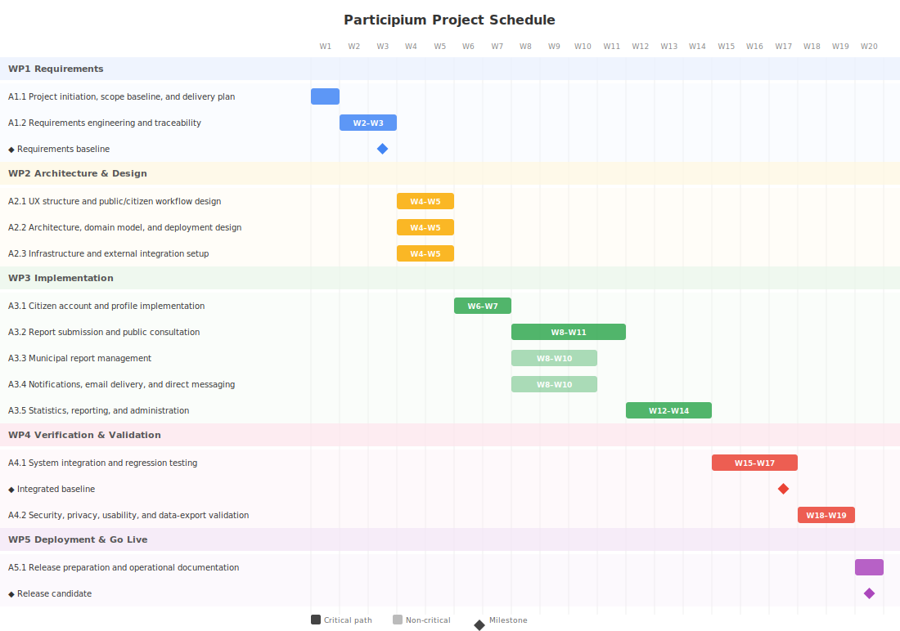
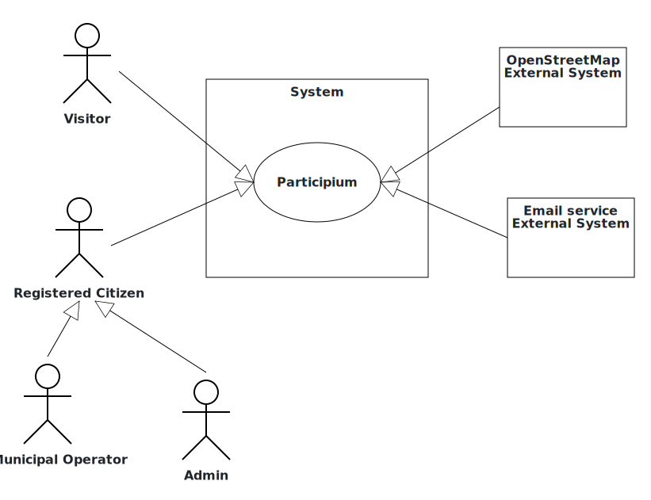
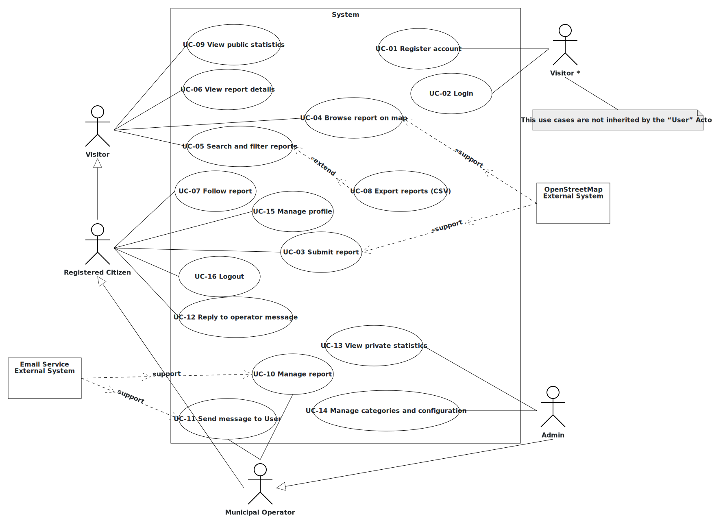
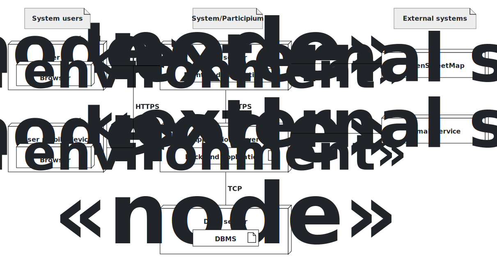

# Participium - Official Documentation

This document aggregates the official Participium documentation sections for single-file PDF export.

Included sections:

- 01 - Project Management
- 02 - Requirements Engineering
- 03 - Use Cases
- 04 - Glossary and Deployment

---

# 01 - Project Management

# Product Breakdown Structure (PBS)

| ID     | Deliverable                                 | Type           | Notes                                                                                                                                  |
| :----- | :------------------------------------------ | :------------- | :------------------------------------------------------------------------------------------------------------------------------------- |
| PBS-S1 | Responsive public web portal                | Software       | Public map view, table view, report detail view, public statistics, and CSV export for published reports.                              |
| PBS-S2 | Citizen account and profile module          | Software       | Registration, email verification, login, profile preferences for email notifications, and optional profile picture.                    |
| PBS-S3 | Report submission module                    | Software       | Map-based report creation with latitude/longitude, title, description, category, up to 3 photos, and public anonymity option.          |
| PBS-S4 | Municipal report management module          | Software       | Initial review, report routing/assignment, status updates, rejection motivation, and resolution handling.                              |
| PBS-S5 | Notification and email module               | Software       | In-platform notifications and optional email delivery for status updates and messages.                                                 |
| PBS-S6 | Direct messaging module                     | Software       | Report-related messaging between citizens and Municipal Operators.                                                                     |
| PBS-S7 | Statistics and reporting module             | Software       | Public statistics by category and time trend; private administrative statistics by status, type/category, reporter, and top reporters. |
| PBS-S8 | Administration and configuration module     | Software       | Configuration of report categories, access/role management, and access to private analytics.                                           |
| PBS-I1 | Web/application hosting environment         | Infrastructure | Runtime environment for the responsive front-end and the back-end application.                                                         |
| PBS-I2 | Data persistence layer                      | Infrastructure | Persistent storage for users, reports, statuses, updates, follows, messages, notifications, categories, and configuration.             |
| PBS-I3 | Photo attachment storage                    | Infrastructure | Storage for report photos, enforcing the maximum of 3 photos per report.                                                               |
| PBS-D1 | Requirements and traceability documentation | Documentation  | Stakeholders, context, interfaces, personas, user stories, FR/NFR, use cases, and traceability.                                        |
| PBS-D2 | Architecture and design documentation       | Documentation  | Class/glossary model and deployment model with official diagram assets and editable sources where available.                           |
| PBS-Q1 | Test and acceptance evidence                | Documentation  | Functional, integration, security/privacy, export, and usability validation evidence.                                                  |
| PBS-R1 | Release package and operational notes       | Documentation  | Deployable application baseline and short operational documentation for configuration and maintenance.                                 |

---

# Work Breakdown Structure (WBS)

### WBS with traceability to PBS

| ID   | Work package                                                       | Traced PBS outputs (IDs)               |
| :--- | :----------------------------------------------------------------- | :------------------------------------- |
| **WP1** | **Requirements**                                                |                                        |
| A1.1 | Project initiation, scope baseline, and delivery plan              | PBS-D1                                 |
| A1.2 | Requirements engineering and traceability                          | PBS-D1                                 |
| **WP2** | **Architecture & Design**                                       |                                        |
| A2.1 | UX structure and public/citizen workflow design                    | PBS-S1, PBS-S2, PBS-S3, PBS-D1         |
| A2.2 | Architecture, domain model, and deployment design                  | PBS-D2, PBS-I1, PBS-I2, PBS-I3         |
| A2.3 | Infrastructure and external integration setup                      | PBS-I1, PBS-I2, PBS-I3                 |
| **WP3** | **Implementation**                                              |                                        |
| A3.1 | Citizen account and profile implementation                         | PBS-S2                                 |
| A3.2 | Report submission and public consultation implementation           | PBS-S1, PBS-S3                         |
| A3.3 | Municipal report management implementation                         | PBS-S4                                 |
| A3.4 | Notifications, email delivery, and direct messaging implementation | PBS-S5, PBS-S6                         |
| A3.5 | Statistics, reporting, and administration implementation           | PBS-S7, PBS-S8                         |
| **WP4** | **Verification & Validation**                                   |                                        |
| A4.1 | System integration and regression testing                          | PBS-Q1                                 |
| A4.2 | Security, privacy, usability, and data-export validation           | PBS-Q1                                 |
| **WP5** | **Deployment & Go Live**                                        |                                        |
| A5.1 | Release preparation and operational documentation                  | PBS-R1, PBS-D2                         |

---

# Gantt, dependencies, and critical path

## Activity table

Duration unit: weeks

| ID   | Activity                                                           | Duration | Dependencies       | Start | End | Critical | Milestone                  |
| :--- | :----------------------------------------------------------------- | :------- | :------------------ | :---- | :-- | :------- | :------------------------- |
| A1.1 | Project initiation, scope baseline, and delivery plan              | 1 week   | -                   | W1    | W1  | Yes      | No                         |
| A1.2 | Requirements engineering and traceability                          | 2 weeks  | A1.1                | W2    | W3  | Yes      | Yes: requirements baseline |
| A2.1 | UX structure and public/citizen workflow design                    | 2 weeks  | A1.2                | W4    | W5  | Yes      | No                         |
| A2.2 | Architecture, domain model, and deployment design                  | 2 weeks  | A1.2                | W4    | W5  | Yes      | No                         |
| A2.3 | Infrastructure and external integration setup                      | 2 weeks  | A1.2                | W4    | W5  | Yes      | No                         |
| A3.1 | Citizen account and profile implementation                         | 2 weeks  | A2.1, A2.2, A2.3    | W6    | W7  | Yes      | No                         |
| A3.2 | Report submission and public consultation implementation           | 4 weeks  | A3.1                | W8    | W11 | Yes      | No                         |
| A3.3 | Municipal report management implementation                         | 3 weeks  | A3.1                | W8    | W10 | No       | No                         |
| A3.4 | Notifications, email delivery, and direct messaging implementation | 3 weeks  | A3.1                | W8    | W10 | No       | No                         |
| A3.5 | Statistics, reporting, and administration implementation           | 3 weeks  | A3.2                | W12   | W14 | Yes      | No                         |
| A4.1 | System integration and regression testing                          | 3 weeks  | A3.3, A3.4, A3.5    | W15   | W17 | Yes      | Yes: integrated baseline   |
| A4.2 | Security, privacy, usability, and data-export validation           | 2 weeks  | A4.1                | W18   | W19 | Yes      | No                         |
| A5.1 | Release preparation and operational documentation                  | 1 week   | A4.2                | W20   | W20 | Yes      | Yes: release candidate     |

## Gantt diagram

Editable/importable source:

- [Mermaid Gantt source](../data/official-documentation/01-project-management/01a-GanttDiagram.mmd)

## Critical path

`A1.1 -> A1.2 -> (A2.1 || A2.2 || A2.3) -> A3.1 -> A3.2 -> A3.5 -> A4.1 -> A4.2 -> A5.1`

**Schedule rationale**

Activities A2.1, A2.2, and A2.3 are all critical because implementation cannot start until the main domain/workflow model and the baseline runtime integrations are ready. A3.3 and A3.4 have limited slack because municipal management and communication can be developed in parallel with public report consultation, but they must both be integrated before A4.1. A3.5 depends on A3.2 because statistics require stable report data and filtering semantics.

---

# Risk Management

**Scales and thresholds**

- **Probability (P)**: 1 (rare) ... 5 (almost certain)
- **Impact (I)**: 1 (minor) ... 5 (critical)
- **Exposure**: `P * I` (range 1-25)

Risk level thresholds (by exposure):

- **Low**: 1-5
- **Medium**: 6-10
- **High**: 11-16
- **Very High**: >16

## Risks table

| ID  | Risk                                                                                                                                          | Category                    |   P |   I | P\*I | Level  | Mitigation / Response strategy                                                                                                               |
| :-- | :-------------------------------------------------------------------------------------------------------------------------------------------- | :-------------------------- | --: | --: | ---: | :----- | :------------------------------------------------------------------------------------------------------------------------------------------- |
| R1  | Scope expands beyond the baseline responsive web application, for example by adding native mobile apps or non-baseline notification channels. | Requirements/Scope          |   3 |   4 |   12 | High   | Keep the baseline traceable to the customer explicit requests; classify extra channels as future work unless formally approved.              |
| R2  | Public reports include personal data, photos, or location details that could expose citizens, especially when anonymity is requested.         | Security/Privacy            |   3 |   5 |   15 | High   | Review public/private field visibility, test anonymous reports, restrict staff-only identity access, and document data-retention rules.      |
| R3  | OpenStreetMap tiles or map integration are unavailable or slow during report submission and public browsing.                                  | External/Third-party        |   2 |   3 |    6 | Medium | Encapsulate map access, display clear map-unavailable errors, and test report validation when location selection is interrupted.             |
| R4  | Email delivery failures prevent account verification or optional notification delivery.                                                       | External/Third-party        |   3 |   3 |    9 | Medium | Use in-platform notifications as the authoritative channel, log email failures, and support resend/retry for verification and notifications. |
| R5  | Photo upload and storage constraints are underestimated, causing validation, storage, or performance problems.                                | Technical                   |   3 |   4 |   12 | High   | Enforce the maximum of 3 photos at validation time, define size/type limits, and include upload tests in integration validation.             |
| R6  | Municipal workflow rules are more complex than the baseline status model.                                                                     | Operational                 |   3 |   4 |   12 | High   | Keep the finite status set explicit, prototype operator workflows early, and document any routing assumptions in the requirements baseline.  |
| R7  | Status updates, followers, and notifications become inconsistent, causing citizens to miss report changes.                                    | Technical                   |   3 |   4 |   12 | High   | Centralize status-change events, test reporter/follower notification paths, and include email-enabled and email-disabled profiles in tests.  |
| R8  | CSV export exposes fields that should not be public.                                                                                          | Security/Privacy            |   2 |   4 |    8 | Medium | Define the export field set from the public table view only and validate exports for anonymous reports and restricted staff-only data.       |
| R9  | Open-source adoption is limited because deployment and configuration are not documented well enough.                                          | Maintainability/Operational |   2 |   3 |    6 | Medium | Include deployment notes, configuration examples, and external service setup instructions in the release package.                            |

**Risk summary**

The highest risks concern privacy, scope control, municipal workflow complexity, and notification consistency. The plan mitigates them by freezing a requirements baseline before implementation, validating external integrations early, and reserving a dedicated validation phase for security/privacy, usability, and data-export checks.

---

# 02 - Requirements Engineering

# 1) Stakeholders

| ID     | Stakeholder name                                  | Description                                                                                                        | Role                                   | Main concerns                                                                                                                           |
| :----- | :------------------------------------------------ | :----------------------------------------------------------------------------------------------------------------- | :------------------------------------- | :-------------------------------------------------------------------------------------------------------------------------------------- |
| STK-01 | Citizens and public users                         | People who use the public portal as visitors or authenticated citizens, including reporters and followers.         | Final users / beneficiaries.           | Transparency, simple consultation, fast report submission, privacy, public anonymity, clear updates, accessibility.                     |
| STK-02 | Municipal users and operators                     | Municipal staff who verify, manage, update, configure, or analyze reports, including operators and administrators. | Operational and administrative users.  | Efficient report handling, reliable status workflow, messaging, category/configuration management, private analytics, workload control. |
| STK-03 | Municipality of Turin                             | Initial public administration adopting Participium.                                                                | Product owner / institutional sponsor. | Public trust, transparency, operational effectiveness, compliance, accessibility, maintainability.                                      |
| STK-04 | Other public administrations                      | Potential future adopters of the open-source solution.                                                             | Secondary adopters.                    | Reusability, configurability, documentation, deployment clarity.                                                                        |
| STK-05 | External service providers                        | OpenStreetMap and the email service used by Participium.                                                           | External service dependencies.         | Correct integration, reliable communication, graceful failure handling.                                                                 |
| STK-06 | Privacy, security, and accessibility stakeholders | Roles responsible for protecting personal data and ensuring public-service accessibility.                          | Governance / compliance.               | Public anonymity, authorized access to identities, safe CSV export, secure authentication, WCAG-aligned web access.                     |

---

# 2) Context Diagram

- 
- [Context diagram UML Modeler JSON](../data/official-documentation/02-requirements-engineering/02a-ContextDiagram.json)
- [Context diagram PDF](../data/official-documentation/02-requirements-engineering/02a-ContextDiagram.pdf)

---

# 3) Interfaces

| ID    | Interface                      | Actor         | Physical interface                       | Logical interface          |
| :---- | :----------------------------- | :------------ | :--------------------------------------- | :------------------------- |
| IF-01 | Public portal interface        | Visitor       | Smartphone/PC with Internet connectivity | Responsive web application |
| IF-02 | Authenticated portal interface | Registered Citizen          | Smartphone/PC with Internet connectivity | Responsive web application |
| IF-03 | Map service interface          | OpenStreetMap | Internet                                 | APIs                       |
| IF-04 | Email service interface        | Email service | Internet                                 | APIs                       |

---

# 4) Personas

| ID     | Name                          | Role                                     | Background / Context                                                                                                 | Goals                                                                                                              | Constraints                                                                                    | Devices / Usage setting                                                           | Accessibility / Additional needs                                                                                       |
| :----- | :---------------------------- | :--------------------------------------- | :------------------------------------------------------------------------------------------------------------------- | :----------------------------------------------------------------------------------------------------------------- | :--------------------------------------------------------------------------------------------- | :-------------------------------------------------------------------------------- | :--------------------------------------------------------------------------------------------------------------------- |
| PER-01 | Marco R.   | Registered citizen / occasional reporter | Commuter who notices urban issues while moving around Turin.                                                         | Submit a report quickly, attach a photo, select a precise map location, stay anonymous publicly if needed.         | Limited time, variable mobile connectivity, uncertainty about categories.                      | Smartphone outdoors; laptop at home for follow-up.                                | Needs clear forms, readable text, and large tap targets.                                                               |
| PER-02 | Giulia B.  | Active citizen / report follower         | Resident who monitors issues in her neighborhood and follows reports submitted by others.                            | Browse reports, filter by category/status, follow relevant reports, receive updates.                               | Does not want to create duplicate reports; wants concise notifications.                        | Smartphone and desktop browser.                                                   | Benefits from clear status labels and simple follow/unfollow actions.                                                  |
| PER-03 | Elena F.   | Municipal verification operator          | Staff member who reviews incoming reports before they are assigned or rejected.                                      | Inspect pending reports, validate content, reject unsupported reports with motivation, route accepted reports.     | High workload, needs consistent categories and clear location/photos.                          | Desktop browser in municipal office.                                              | Needs efficient table/list views and low-friction status update forms.                                                 |
| PER-04 | Roberto C. | Technical office operator                | Operator responsible for addressing reports in a specific service area.                                              | See assigned reports, update status, communicate with citizens, mark reports resolved or suspended.                | Must coordinate with operational work outside the system.                                      | Desktop browser; occasional tablet use on site.                                   | Needs unambiguous status history and access to photos/location.                                                        |
| PER-05 | Nadia S.   | Administrator                            | System administrator supporting municipal configuration and analytics.                                               | Manage categories/access settings and view private statistics.                                                     | Must avoid disrupting historical report data and protect personal data.                        | Desktop browser in office.                                                        | Needs clear warnings for configuration changes and reliable analytics filters.                                         |
| PER-06 | Luca M.    | Visitor / public observer                | Unregistered citizen or local journalist consulting public transparency data.                                        | Browse map/table, export CSV, view public statistics.                                                              | No authenticated access; only public information should be visible.                            | Desktop browser.                                                                  | Needs understandable filters and export fields.                                                                        |
| PER-07 | Paola V.   | Visitor with accessibility needs         | Citizen with low vision who uses the public portal to understand what has already been reported in her neighborhood. | Browse reports and public statistics without needing assistance, use filters, and read status information clearly. | Relies on browser zoom, high contrast, keyboard navigation, and screen-reader-friendly labels. | Desktop browser with assistive settings; sometimes smartphone with enlarged text. | Requires accessible forms, sufficient contrast, keyboard navigation, meaningful labels, and WCAG-aligned public pages. |

---

# 5) User Stories

| ID    | Persona/Role                                                                             | User story (As a... I want... so that...)                                                                                                                     |
| :---- | :--------------------------------------------------------------------------------------- | :------------------------------------------------------------------------------------------------------------------------------------------------------------ |
| US-01 | [PER-01 - Marco R.](#per-01)                                                             | As a Visitor, I want to create and verify a citizen account so that I can submit reports and interact with the municipality.                       |
| US-02 | [PER-01 - Marco R.](#per-01)                                                             | As a registered citizen, I want to log in and manage my notification preferences so that I can receive updates in the channel I prefer.                       |
| US-03 | [PER-01 - Marco R.](#per-01)                                                             | As a registered citizen, I want to submit a geo-located report with title, description, category, and photos so that the municipality can evaluate the issue. |
| US-04 | [PER-01 - Marco R.](#per-01)                                                             | As a registered citizen, I want to hide my identity in public views of a report so that I can report issues without being publicly identified.                |
| US-05 | [PER-06 - Luca M.](#per-06), [PER-07 - Paola V.](#per-07)                                | As a visitor, I want to browse reports on a map so that I can understand where issues have been reported.                                                     |
| US-06 | [PER-06 - Luca M.](#per-06), [PER-07 - Paola V.](#per-07)                                | As a visitor, I want to filter and sort reports in a table so that I can find reports by category, status, and time period.                                   |
| US-07 | [PER-06 - Luca M.](#per-06), [PER-07 - Paola V.](#per-07)                                | As a visitor, I want to open a report detail page so that I can read complete public information about the issue and its current status.                      |
| US-08 | [PER-02 - Giulia B.](#per-02)                                                            | As a registered citizen, I want to follow a report submitted by someone else so that I receive updates about its evolution.                                   |
| US-09 | [PER-06 - Luca M.](#per-06)                                                              | As a visitor, I want to export the report table as CSV so that I can analyze or share public data offline.                                                    |
| US-10 | [PER-06 - Luca M.](#per-06), [PER-07 - Paola V.](#per-07)                                | As a visitor, I want to view public statistics so that I can understand issue categories and trends over time.                                                |
| US-11 | [PER-03 - Elena F.](#per-03), [PER-04 - Roberto C.](#per-04)                             | As a Municipal Operator, I want to review and update reports so that the municipality can manage the report lifecycle transparently.                          |
| US-12 | [PER-03 - Elena F.](#per-03), [PER-04 - Roberto C.](#per-04)                             | As a Municipal Operator, I want to send messages to citizens about reports so that I can request clarifications or provide updates.                           |
| US-13 | [PER-01 - Marco R.](#per-01)                                                             | As a registered citizen, I want to reply to operator messages so that I can clarify my report through the platform.                                           |
| US-14 | [PER-05 - Nadia S.](#per-05)                                                             | As an administrator, I want to view private statistics so that I can support internal management decisions.                                                   |
| US-15 | [PER-05 - Nadia S.](#per-05)                                                             | As an administrator, I want to manage categories and configuration so that the system remains aligned with municipal responsibilities.                        |
| US-16 | [PER-01 - Marco R.](#per-01), [PER-03 - Elena F.](#per-03), [PER-05 - Nadia S.](#per-05) | As a Registered Citizen, Municipal Operator, or Administrator, I want to log out so that I can end my session when I stop using the portal.                                                        |

---

# 6) Functional Requirements (FR)

| ID    | Requirement statement (The system shall...)                                                                                                                                                                                                                 | Priority | User story ID                                          | Notes                                                                                       |
| :---- | :---------------------------------------------------------------------------------------------------------------------------------------------------------------------------------------------------------------------------------------------------------- | :------- | :----------------------------------------------------- | :------------------------------------------------------------------------------------------ |
| FR-01 | The system shall allow a Visitor to create a citizen account by providing username, first name, last name, and email address, and shall require email verification before account activation.                                                    | Must     | US-01                                                  | Email verification is part of the baseline registration flow.                               |
| FR-02 | The system shall authenticate registered users before allowing reserved actions such as report submission, following reports, messaging, profile changes, operator actions, or administration.                                                              | Must     | US-02, US-03, US-08, US-11, US-12, US-13, US-14, US-15 | Role-based access is required for citizen, operator, and administrator functions.           |
| FR-03 | The system shall allow citizens to manage profile preferences, including whether to receive email notifications in addition to in-platform notifications and an optional profile picture.                                                                   | Should   | US-02                                                  | Email notifications are optional and user-controlled.                                       |
| FR-04 | The system shall allow authenticated citizens to submit reports with latitude/longitude selected on an OpenStreetMap-based map, title, description, category, and one to three photos.                                                                      | Must     | US-03                                                  | The maximum number of photos is 3.                                                          |
| FR-05 | The system shall allow citizens to mark a report as anonymous for public views, hiding the reporter identity from public pages while keeping the report published and trackable.                                                                            | Must     | US-04                                                  | Staff-only access to reporter identity is a privacy/security concern.                       |
| FR-06 | The system shall manage reports using the finite status set Pending Approval, Assigned, In Progress, Suspended, Rejected, and Resolved.                                                                                                                     | Must     | US-07, US-11                                           | Status labels are taken from the baseline specification.                                    |
| FR-07 | The system shall require an explicit motivation when a Municipal Operator rejects a report.                                                                                                                                                                 | Must     | US-11                                                  | Supports transparency and citizen understanding.                                            |
| FR-08 | The system shall display published reports on a public map and allow users to open the corresponding detail view from the map.                                                                                                                              | Must     | US-05, US-07                                           | Map view uses OpenStreetMap-based visualization.                                            |
| FR-09 | The system shall display published reports in a public table view with filtering by category, status, and time period, and sorting by relevant fields such as date.                                                                                         | Must     | US-06                                                  | Filters must be consistent with category/status definitions.                                |
| FR-10 | The system shall export the currently visible table results in CSV format.                                                                                                                                                                                  | Should   | US-09                                                  | Export contains public report data only.                                                    |
| FR-11 | The system shall provide a report detail page showing title, description, category, map location, attached photos, current status, and available updates.                                                                                                   | Must     | US-07                                                  | Detail view is shared by citizens and municipal staff with role-specific actions.           |
| FR-12 | The system shall allow authenticated citizens to follow reports, including reports submitted by other citizens.                                                                                                                                             | Should   | US-08                                                  | Followers receive the same update notifications as the original reporter.                   |
| FR-13 | The system shall generate in-platform notifications for the reporting citizen and all followers whenever a report status changes.                                                                                                                           | Must     | US-08, US-11                                           | In-platform notifications are the authoritative notification channel.                       |
| FR-14 | The system shall send email copies of notifications and messages only to users who have email notifications enabled, where email delivery is applicable.                                                                                                    | Should   | US-02, US-08, US-11, US-12                             | Email is optional in addition to in-platform notifications.                                 |
| FR-15 | The system shall support direct report-related messaging between Municipal Operators and citizens, including operator messages and citizen replies.                                                                                                         | Should   | US-12, US-13                                           | Messaging is a first-class communication channel in the baseline.                           |
| FR-16 | The system shall provide public statistics visible to Visitors, including reports by category and trends over time aggregated by day, week, or month.                                                                                             | Should   | US-10                                                  | Public transparency feature.                                                                |
| FR-17 | The system shall provide administrator-only private statistics including reports by status, type/category, type/category and status, reporter, reporter and type/category, reporter/type/category/status, and top 1% and top 5% reporters by type/category. | Should   | US-14                                                  | Uses type/category to keep the baseline wording aligned with the defined report categories. |
| FR-18 | The system shall allow administrators to manage configuration aspects including categories and user access settings.                                                                                                                                        | Should   | US-15                                                  | Changes to categories must be handled carefully when existing reports use them.             |
| FR-19 | The system shall allow Registered Citizens, Municipal Operators, and Administrators to log out and shall terminate their authenticated session before redirecting them to a non-restricted area.                                                                                                     | Must     | US-16                                                  | Applies to all authenticated roles: Registered Citizens, Municipal Operators, and Administrators.      |

---

# 7) Non-Functional Requirements (NFR)

| ID     | Category                   | Requirement statement                                                                                                          | Metric / Target                                                                                                             | Verification                                            | Priority | Notes                                                                            |
| :----- | :------------------------- | :----------------------------------------------------------------------------------------------------------------------------- | :-------------------------------------------------------------------------------------------------------------------------- | :------------------------------------------------------ | :------- | :------------------------------------------------------------------------------- |
| NFR-01 | Usability / Responsiveness | The public and citizen-facing UI shall be usable on desktop and mobile browsers.                                               | Core flows complete without horizontal scrolling on representative desktop and smartphone viewport sizes.                   | Manual UI test on representative viewports.             | Must     | Baseline describes a responsive web application.                                 |
| NFR-02 | Performance                | Public report list and detail pages shall provide acceptable response time for normal consultation.                            | For a representative dataset agreed during testing, public list/detail pages load within 3 seconds on the test environment. | Performance test or monitored manual test.              | Should   | Exact production load target must be refined with deployment assumptions.        |
| NFR-03 | Security                   | Authenticated and role-restricted actions shall not be available to unauthenticated users or users with the wrong role.        | 100% of reserved endpoints/pages covered by access-control tests or review checklist.                                       | Automated tests and security review.                    | Must     | Covers citizen, operator, and administrator areas.                               |
| NFR-04 | Privacy                    | Anonymous public reports shall not expose the reporter identity in public map, table, detail, statistics, or CSV export views. | 0 reporter identity fields visible in public outputs for anonymous reports.                                                 | Functional privacy test and export inspection.          | Must     | Directly supports the anonymity option.                                          |
| NFR-05 | Reliability                | In-platform notifications shall remain available even when email delivery fails.                                               | Simulated email failure still creates in-platform notification and records/logs the email failure.                          | Integration test with email failure simulation.         | Must     | Email is optional and cannot block platform notification.                        |
| NFR-06 | Data integrity             | Status changes shall preserve a traceable update record.                                                                       | Each status change stores timestamp, old status, new status, and associated report.                                         | Database inspection and integration test.               | Should   | Consistent with the official class model concept of Update.                      |
| NFR-07 | Accessibility              | The public portal shall follow basic accessibility practices for text, controls, and forms.                                    | Manual checklist aligned with WCAG 2.1 AA for key public flows.                                                             | Accessibility review.                                   | Should   | Relevant for a public administration service.                                    |
| NFR-08 | Maintainability            | The system shall remain configurable for categories and suitable for open-source reuse by other administrations.               | Category list is configuration-managed and deployment/configuration notes are provided.                                     | Code/configuration inspection and documentation review. | Should   | Baseline states that Participium is open-source and reusable.                    |
| NFR-09 | Auditability               | Operator status updates and citizen/operator messages shall be timestamped.                                                    | Each update/message has a creation timestamp in persistence.                                                                | Database inspection and functional test.                | Should   | Supports transparency and operational follow-up.                                 |
| NFR-10 | Export safety              | CSV exports shall contain only fields visible in the public table view.                                                        | Export schema matches approved public field list.                                                                           | Export inspection test.                                 | Must     | Prevents accidental disclosure through offline export.                           |
| NFR-11 | Availability               | The public portal shall remain available during normal service hours with planned maintenance communicated in advance.         | At least 99.5% monthly availability for the public portal, excluding planned maintenance windows.                           | Monitoring report and incident/maintenance log review.  | Should   | Relevant because Participium is a public web portal for a public administration. |

---

# 03 - Use Cases

# 1) Use Case Diagram

- 
- [Use case diagram UML Modeler JSON](../data/official-documentation/03-use-cases/03a-UseCaseDiagram.json)
- [Use case diagram PDF](../data/official-documentation/03-use-cases/03a-UseCaseDiagram.pdf)

# 2) Use Case Narratives

| Use Case                | Register account                                                                                                                                                                                                                                                                                                                                                                                                                                                                                                                                         |
| :---------------------- | :------------------------------------------------------------------------------------------------------------------------------------------------------------------------------------------------------------------------------------------------------------------------------------------------------------------------------------------------------------------------------------------------------------------------------------------------------------------------------------------------------------------------------------------------------- |
| ID                      | UC-01                                                                                                                                                                                                                                                                                                                                                                                                                                                                                                                                                    |
| Scope                   | Participium - Citizen Participation Web System                                                                                                                                                                                                                                                                                                                                                                                                                                                                                                           |
| Level                   | User-goal                                                                                                                                                                                                                                                                                                                                                                                                                                                                                                                                                |
| Intention in Context    | A visitor wants to create a citizen account in order to submit reports and interact with the municipality.                                                                                                                                                                                                                                                                                                                                                                                                                                                |
| Primary actor           | Visitor                                                                                                                                                                                                                                                                                                                                                                                                                                                                                                                                                  |
| Supporting actors       | Email service                                                                                                                                                                                                                                                                                                                                                                                                                                                                                                                                            |
| Stakeholders' interests | Citizen wants account activation; municipality wants verified contact information; administrators want controlled access to reserved features.                                                                                                                                                                                                                                                                                                                                                                                                           |
| Precondition            | The Visitor is not authenticated and does not already have an active account with the same username or email.                                                                                                                                                                                                                                                                                                                                                                                                                                               |
| Minimum guarantees      | No active account is created if validation or email verification fails.                                                                                                                                                                                                                                                                                                                                                                                                                                                                                  |
| Success guarantees      | A verified citizen account is activated and can be used for authenticated citizen features.                                                                                                                                                                                                                                                                                                                                                                                                                                                              |
| Main success scenario   | <ol><li>Visitor navigates to the registration page.</li><li>System displays the registration form requesting username, first name, last name, and email address.</li><li>Visitor fills in all required fields and submits the form.</li><li>System validates completeness and uniqueness of username and email, creates a pending account, and sends a verification email.</li><li>Visitor opens the verification email and clicks the confirmation link.</li><li>System activates the account and confirms registration.</li></ol>The use case ends with success. |
| Extensions              | <ul><li>4a Username already taken: system informs the visitor and asks for a different username.</li><li>4b Email already registered: system informs the visitor and asks for a different email address.</li><li>4c Required field missing: system highlights missing fields and asks the visitor to complete them.</li><li>5a Verification link expired or not used in time: system keeps the account inactive. The use case ends with failure.</li></ul> |

| Use Case                | Login                                                                                                                                                                                                                                                                                          |
| :---------------------- | :--------------------------------------------------------------------------------------------------------------------------------------------------------------------------------------------------------------------------------------------------------------------------------------------- |
| ID                      | UC-02                                                                                                                                                                                                                                                                                          |
| Scope                   | Participium - Citizen Participation Web System                                                                                                                                                                                                                                                 |
| Level                   | User-goal                                                                                                                                                                                                                                                                                      |
| Intention in Context    | A Registered Citizen wants to authenticate in order to access features reserved for logged-in users.                                                                                                                                                                                           |
| Primary actor           | Registered Citizen                                                                                                                                                                                                                                                                             |
| Supporting actors       | None                                                                                                                                                                                                                                                                                           |
| Stakeholders' interests | Registered Citizen wants access to reserved features; municipality wants only authorized users to submit/manage reports; administrators want role-based access control.                                                                                                                         |
| Precondition            | The Registered Citizen has an existing account.                                                                                                                                                                                                                                                |
| Minimum guarantees      | Invalid credentials do not create an authenticated session.                                                                                                                                                                                                                                    |
| Success guarantees      | The Registered Citizen is authenticated with the role associated with the account.                                                                                                                                                                                                             |
| Main success scenario   | <ol><li>Registered Citizen navigates to the login page.</li><li>System displays the login form requesting credentials.</li><li>Registered Citizen enters credentials and submits the form.</li><li>System validates the credentials, authenticates the Registered Citizen, and redirects them to the appropriate area.</li></ol>The use case ends with success. |
| Extensions              | <ul><li>4a Credentials are invalid: system informs the Registered Citizen and allows retry.</li><li>4b Account is not verified: system informs the Registered Citizen that email verification is required and may offer to resend the verification email. The use case ends with failure.</li></ul>                         |

| Use Case                | Submit report                                                                                                                                                                                                                                                                                                                                                                                                                                                                                                                                   |
| :---------------------- | :---------------------------------------------------------------------------------------------------------------------------------------------------------------------------------------------------------------------------------------------------------------------------------------------------------------------------------------------------------------------------------------------------------------------------------------------------------------------------------------------------------------------------------------------- |
| ID                      | UC-03                                                                                                                                                                                                                                                                                                                                                                                                                                                                                                                                           |
| Scope                   | Participium - Citizen Participation Web System                                                                                                                                                                                                                                                                                                                                                                                                                                                                                                  |
| Level                   | User-goal                                                                                                                                                                                                                                                                                                                                                                                                                                                                                                                                       |
| Intention in Context    | An authenticated citizen wants to report a geo-located urban issue to the municipality.                                                                                                                                                                                                                                                                                                                                                                                                                                                         |
| Primary actor           | Citizen                                                                                                                                                                                                                                                                                                                                                                                                                                                                                                                                         |
| Supporting actors       | OpenStreetMap                                                                                                                                                                                                                                                                                                                                                                                                                                                                                                                                   |
| Stakeholders' interests | Citizen wants to report an issue quickly; municipality wants complete and classifiable information; visitors need reliable public report data.                                                                                                                                                                                                                                                                                                                                                                                                   |
| Precondition            | Citizen is authenticated.                                                                                                                                                                                                                                                                                                                                                                                                                                                                                                                       |
| Minimum guarantees      | No incomplete or invalid report is published; uploaded photos remain within configured limits.                                                                                                                                                                                                                                                                                                                                                                                                                                                  |
| Success guarantees      | A report is created with status Pending Approval and is available for municipal review.                                                                                                                                                                                                                                                                                                                                                                                                                                                         |
| Main success scenario   | <ol><li>Citizen opens the report submission page.</li><li>System displays an OpenStreetMap-based map of Turin and the report form.</li><li>Citizen selects the issue position on the map.</li><li>System records latitude and longitude.</li><li>Citizen enters title, description, and category, attaches one to three photos, optionally marks the report as anonymous for public views, and submits the report.</li><li>System validates location, required fields, category, and attachment count, and creates the report with status Pending Approval.</li></ol>The use case ends with success. |
| Extensions              | <ul><li>3a Location not selected: system asks the citizen to choose a map position.</li><li>6a Required field missing: system highlights missing fields and asks for completion.</li><li>6b More than three photos attached: system rejects the excess attachments and asks the citizen to reduce the number.</li></ul> |

| Use Case                | Browse reports on map                                                                                                                                                                                                                                                                                              |
| :---------------------- | :----------------------------------------------------------------------------------------------------------------------------------------------------------------------------------------------------------------------------------------------------------------------------------------------------------------- |
| ID                      | UC-04                                                                                                                                                                                                                                                                                                              |
| Scope                   | Participium - Citizen Participation Web System                                                                                                                                                                                                                                                                     |
| Level                   | User-goal                                                                                                                                                                                                                                                                                                          |
| Intention in Context    | A Visitor wants to visually explore published reports on the city map.                                                                                                                                                                                                                                                |
| Primary actor           | Visitor                                                                                                                                                                                                                                                                                                            |
| Supporting actors       | OpenStreetMap                                                                                                                                                                                                                                                                                                      |
| Stakeholders' interests | Visitor wants transparency; municipality wants public visibility of handled reports; OpenStreetMap provides map visualization support.                                                                                                                                                                             |
| Precondition            | Public portal is available.                                                                                                                                                                                                                                                                                        |
| Minimum guarantees      | If reports or map tiles are not available, the Visitor receives a clear empty or error state.                                                                                                                                                                                                                         |
| Success guarantees      | The visitor can identify geo-located reports and navigate to a selected report detail.                                                                                                                                                                                                                             |
| Main success scenario   | <ol><li>Visitor navigates to the public map view.</li><li>System displays an OpenStreetMap-based map of Turin with report markers.</li><li>Visitor pans or zooms the map and selects a report marker.</li><li>System displays summary information for the selected report.</li><li>Visitor opens the full report detail view.</li></ol>The use case ends with success. |
| Extensions              | <ul><li>2a Map tiles unavailable: system displays a temporary map-unavailable message. The use case ends with failure.</li><li>3a No reports in the visible area: system shows no markers and the visitor may move to another area.</li></ul> |

| Use Case                | Search and filter reports                                                                                                                                                                                                                                                                                                                                           |
| :---------------------- | :------------------------------------------------------------------------------------------------------------------------------------------------------------------------------------------------------------------------------------------------------------------------------------------------------------------------------------------------------------------ |
| ID                      | UC-05                                                                                                                                                                                                                                                                                                                                                               |
| Scope                   | Participium - Citizen Participation Web System                                                                                                                                                                                                                                                                                                                      |
| Level                   | User-goal                                                                                                                                                                                                                                                                                                                                                           |
| Intention in Context    | A Visitor wants to find reports by applying filters and sorting in the table view.                                                                                                                                                                                                                                                                                     |
| Primary actor           | Visitor                                                                                                                                                                                                                                                                                                                                                             |
| Supporting actors       | None                                                                                                                                                                                                                                                                                                                                                                |
| Stakeholders' interests | Visitor wants efficient discovery; municipality wants transparent and understandable public report lists.                                                                                                                                                                                                                                                           |
| Precondition            | Public table view is available.                                                                                                                                                                                                                                                                                                                                     |
| Minimum guarantees      | Filters do not change stored report data.                                                                                                                                                                                                                                                                                                                           |
| Success guarantees      | The report list reflects the selected category, status, time period, and sorting.                                                                                                                                                                                                                                                                                   |
| Main success scenario   | <ol><li>Visitor navigates to the public table view.</li><li>System displays published reports with default sorting by date.</li><li>Visitor applies one or more filters by category, status, and/or time period.</li><li>System updates the list to show matching reports.</li><li>Visitor changes sorting.</li><li>System reorders and displays the results.</li></ol>The use case ends with success. |
| Extensions              | <ul><li>4a No reports match the selected filters: system displays an empty result message and the visitor may change filters.</li></ul>                                                                                                                                                                                                                             |

| Use Case                | View report details                                                                                                                                                                                                                                         |
| :---------------------- | :---------------------------------------------------------------------------------------------------------------------------------------------------------------------------------------------------------------------------------------------------------- |
| ID                      | UC-06                                                                                                                                                                                                                                                       |
| Scope                   | Participium - Citizen Participation Web System                                                                                                                                                                                                              |
| Level                   | User-goal                                                                                                                                                                                                                                                   |
| Intention in Context    | A Visitor wants to read complete public information about a specific report.                                                                                                                                                                                   |
| Primary actor           | Visitor                                                                                                                                                                                                                                                     |
| Supporting actors       | OpenStreetMap                                                                                                                                                                                                                                               |
| Stakeholders' interests | Visitor wants understandable details; citizen reporter wants accurate status communication; municipality wants a single reference view for the issue.                                                                                                       |
| Precondition            | The selected report is available in the public portal.                                                                                                                                                                                                      |
| Minimum guarantees      | If the report is unavailable, no incorrect or partial detail page is shown.                                                                                                                                                                                 |
| Success guarantees      | The report detail page shows title, description, category, map location, photos, current status, and available updates.                                                                                                                                     |
| Main success scenario   | <ol><li>Visitor selects a report from the map view or table view.</li><li>System displays the report detail page with title, description, category, location on map, attached photos, current status, and available updates.</li></ol>The use case ends with success. |
| Extensions              | <ul><li>2a Report no longer available: system displays a message indicating that the report is not available. The use case ends with failure.</li></ul>                                                                                                     |

| Use Case                | Follow report                                                                                                                                                                                                                                                                                                   |
| :---------------------- | :-------------------------------------------------------------------------------------------------------------------------------------------------------------------------------------------------------------------------------------------------------------------------------------------------------------- |
| ID                      | UC-07                                                                                                                                                                                                                                                                                                           |
| Scope                   | Participium - Citizen Participation Web System                                                                                                                                                                                                                                                                  |
| Level                   | User-goal                                                                                                                                                                                                                                                                                                       |
| Intention in Context    | An authenticated citizen wants to follow a report submitted by another citizen in order to receive updates.                                                                                                                                                                                                     |
| Primary actor           | Citizen                                                                                                                                                                                                                                                                                                         |
| Supporting actors       | Email service                                                                                                                                                                                                                                                                                                   |
| Stakeholders' interests | Follower wants status updates; reporter benefits from public transparency; municipality wants citizens informed without duplicate reports.                                                                                                                                                                      |
| Precondition            | Citizen is authenticated and the report is available.                                                                                                                                                                                                                                                           |
| Minimum guarantees      | The system does not create duplicate follow records for the same citizen and report.                                                                                                                                                                                                                            |
| Success guarantees      | The citizen is registered as a follower and will receive update notifications according to preferences.                                                                                                                                                                                                         |
| Main success scenario   | <ol><li>Citizen opens the detail page of a report.</li><li>System displays the report details and a Follow action.</li><li>Citizen activates the Follow action.</li><li>System registers the citizen as a follower and confirms that the citizen is following the report.</li></ol>The use case ends with success. |
| Extensions              | <ul><li>3a Citizen is already following the report: system informs the citizen and may offer an Unfollow action.</li><li>3b Citizen is not authenticated: system asks the user to log in before following. The use case ends with failure.</li></ul>                                                             |

| Use Case                | Export reports (CSV)                                                                                                                                                                                                             |
| :---------------------- | :------------------------------------------------------------------------------------------------------------------------------------------------------------------------------------------------------------------------------- |
| ID                      | UC-08                                                                                                                                                                                                                            |
| Scope                   | Participium - Citizen Participation Web System                                                                                                                                                                                   |
| Level                   | User-goal                                                                                                                                                                                                                        |
| Intention in Context    | A Visitor wants to download the currently visible list of reports as a CSV file.                                                                                                                                                    |
| Primary actor           | Visitor                                                                                                                                                                                                                          |
| Supporting actors       | None                                                                                                                                                                                                                             |
| Stakeholders' interests | Visitor wants offline analysis or sharing; municipality wants transparent public data without exposing restricted fields.                                                                                                        |
| Precondition            | The table view is open, optionally with filters applied.                                                                                                                                                                         |
| Minimum guarantees      | If no data is available, no misleading export is produced.                                                                                                                                                                       |
| Success guarantees      | The browser downloads a CSV file containing the current public result set.                                                                                                                                                       |
| Main success scenario   | <ol><li>Visitor activates CSV export.</li><li>System generates a CSV file for the reports matching the active filters and delivers it to the browser as a download.</li></ol>The use case ends with success.                     |
| Extensions              | <ul><li>2a Result set is empty: system informs the visitor that there are no reports to export. The use case ends with failure.</li></ul>                                                                                        |

| Use Case                | View public statistics                                                                                                                                                                                                                                                                        |
| :---------------------- | :-------------------------------------------------------------------------------------------------------------------------------------------------------------------------------------------------------------------------------------------------------------------------------------------- |
| ID                      | UC-09                                                                                                                                                                                                                                                                                         |
| Scope                   | Participium - Citizen Participation Web System                                                                                                                                                                                                                                                |
| Level                   | User-goal                                                                                                                                                                                                                                                                                     |
| Intention in Context    | A Visitor wants to consult aggregated statistics about published reports.                                                                                                                                                                                                                        |
| Primary actor           | Visitor                                                                                                                                                                                                                                                                                       |
| Supporting actors       | None                                                                                                                                                                                                                                                                                          |
| Stakeholders' interests | Visitor wants transparency; municipality wants public reporting on categories and trends.                                                                                                                                                                                                     |
| Precondition            | Public statistics page is available.                                                                                                                                                                                                                                                          |
| Minimum guarantees      | If no data is available, the Visitor receives an empty state instead of incorrect charts.                                                                                                                                                                                                        |
| Success guarantees      | The Visitor can view reports by category and time trends aggregated by day, week, or month.                                                                                                                                                                                                      |
| Main success scenario   | <ol><li>Visitor navigates to the public statistics page.</li><li>System displays charts showing number of reports by category.</li><li>Visitor selects a time aggregation level.</li><li>System updates trend charts using day, week, or month aggregation.</li></ol>The use case ends with success. |
| Extensions              | <ul><li>3a No data for the selected period: system displays empty charts and informs the visitor that no data is available.</li></ul>                                                                                                                                                         |

| Use Case                | Manage report                                                                                                                                                                                                                                                                                                                                                                                                                                                                                              |
| :---------------------- | :--------------------------------------------------------------------------------------------------------------------------------------------------------------------------------------------------------------------------------------------------------------------------------------------------------------------------------------------------------------------------------------------------------------------------------------------------------------------------------------------------------- |
| ID                      | UC-10                                                                                                                                                                                                                                                                                                                                                                                                                                                                                                      |
| Scope                   | Participium - Citizen Participation Web System                                                                                                                                                                                                                                                                                                                                                                                                                                                             |
| Level                   | User-goal                                                                                                                                                                                                                                                                                                                                                                                                                                                                                                  |
| Intention in Context    | A Municipal Operator wants to review a pending or active report, update its status, and route it to the correct office.                                                                                                                                                                                                                                                                                                                                                                                    |
| Primary actor           | Municipal Operator                                                                                                                                                                                                                                                                                                                                                                                                                                                                                         |
| Supporting actors       | Email service                                                                                                                                                                                                                                                                                                                                                                                                                                                                                              |
| Stakeholders' interests | Municipal Operator wants efficient handling; citizen wants clear updates; municipality wants transparent and accountable lifecycle management.                                                                                                                                                                                                                                                                                                                                                                       |
| Precondition            | Municipal Operator is authenticated.                                                                                                                                                                                                                                                                                                                                                                                                                                                                       |
| Minimum guarantees      | The report remains in a valid status and invalid updates are rejected.                                                                                                                                                                                                                                                                                                                                                                                                                                     |
| Success guarantees      | The report status is updated, the update is recorded, and reporter/followers receive notifications according to preferences.                                                                                                                                                                                                                                                                                                                                                                               |
| Main success scenario   | <ol><li>Municipal Operator accesses the list of reports assigned to or handled by their office.</li><li>System displays the reports with current statuses.</li><li>Municipal Operator selects a report.</li><li>System displays full report details.</li><li>Municipal Operator updates the report status and optionally provides a motivation.</li><li>System saves the new status, generates in-platform notifications for the reporter and followers, and sends email notifications to users who have email notifications enabled.</li></ol>The use case ends with success. |
| Extensions              | <ul><li>5a Rejected status selected without motivation: system asks the Municipal Operator to enter a mandatory rejection motivation.</li><li>6a Email service unavailable: system logs the delivery failure and still delivers in-platform notifications.</li></ul>                                                                                                                                                                                                                                                 |

| Use Case                | Send message to Citizen                                                                                                                                                                                                                                                                                                                            |
| :---------------------- | :---------------------------------------------------------------------------------------------------------------------------------------------------------------------------------------------------------------------------------------------------------------------------------------------------------------------------------------------- |
| ID                      | UC-11                                                                                                                                                                                                                                                                                                                                           |
| Scope                   | Participium - Citizen Participation Web System                                                                                                                                                                                                                                                                                                  |
| Level                   | User-goal                                                                                                                                                                                                                                                                                                                                       |
| Intention in Context    | A Municipal Operator wants to contact the citizen who submitted a report in order to request clarification or provide an update.                                                                                                                                                                                                                |
| Primary actor           | Municipal Operator                                                                                                                                                                                                                                                                                                                              |
| Supporting actors       | Email service                                                                                                                                                                                                                                                                                                                                   |
| Stakeholders' interests | Municipal Operator wants clarification; citizen wants communication in the platform; municipality wants traceable report-related messages.                                                                                                                                                                                                                |
| Precondition            | Municipal Operator is authenticated and the report detail page is available.                                                                                                                                                                                                                                                                    |
| Minimum guarantees      | Empty messages are not sent.                                                                                                                                                                                                                                                                                                                    |
| Success guarantees      | The message is delivered in-platform to the citizen and optionally by email according to preferences.                                                                                                                                                                                                                                           |
| Main success scenario   | <ol><li>Municipal Operator opens the detail page of a report.</li><li>System displays the messaging area associated with the report.</li><li>Municipal Operator composes a message and sends it.</li><li>System delivers the message to the citizen as an in-platform notification and sends it also by email if the citizen has email notifications enabled.</li></ol>The use case ends with success. |
| Extensions              | <ul><li>3a Message body is empty: system asks the Municipal Operator to enter message content.</li><li>4a Email service unavailable: system logs the failure and keeps the in-platform message delivered.</li></ul>                                                                                                                                       |

| Use Case                | Reply to Municipal Operator message                                                                                                                                                                                                                                                         |
| :---------------------- | :-------------------------------------------------------------------------------------------------------------------------------------------------------------------------------------------------------------------------------------------------------------------------------- |
| ID                      | UC-12                                                                                                                                                                                                                                                                             |
| Scope                   | Participium - Citizen Participation Web System                                                                                                                                                                                                                                    |
| Level                   | User-goal                                                                                                                                                                                                                                                                         |
| Intention in Context    | An authenticated citizen wants to respond to a Municipal Operator message about one of their reports.                                                                                                                                                                             |
| Primary actor           | Citizen                                                                                                                                                                                                                                                                           |
| Supporting actors       | None                                                                                                                                                                                                                                                                              |
| Stakeholders' interests | Citizen wants to clarify information; Municipal Operator wants a traceable response; municipality wants the conversation attached to the report.                                                                                                                                            |
| Precondition            | Citizen is authenticated and has received at least one Municipal Operator message on the report.                                                                                                                                                                                            |
| Minimum guarantees      | Empty replies are not sent.                                                                                                                                                                                                                                                       |
| Success guarantees      | The reply is delivered to the Municipal Operator in-platform.                                                                                                                                                                                                                               |
| Main success scenario   | <ol><li>Citizen opens the detail page of the report containing the Municipal Operator message.</li><li>System displays the messaging thread.</li><li>Citizen composes a reply and sends it.</li><li>System delivers the reply to the Municipal Operator as an in-platform notification.</li></ol>The use case ends with success. |
| Extensions              | <ul><li>3a Reply body is empty: system asks the citizen to enter message content.</li></ul>                                                                                                                                                                                       |

| Use Case                | View private statistics                                                                                                                                                                                                                                                                                                  |
| :---------------------- | :----------------------------------------------------------------------------------------------------------------------------------------------------------------------------------------------------------------------------------------------------------------------------------------------------------------------- |
| ID                      | UC-13                                                                                                                                                                                                                                                                                                                    |
| Scope                   | Participium - Citizen Participation Web System                                                                                                                                                                                                                                                                           |
| Level                   | User-goal                                                                                                                                                                                                                                                                                                                |
| Intention in Context    | An administrator wants to consult detailed analytics about reports to support internal management decisions.                                                                                                                                                                                                             |
| Primary actor           | Administrator                                                                                                                                                                                                                                                                                                            |
| Supporting actors       | None                                                                                                                                                                                                                                                                                                                     |
| Stakeholders' interests | Administrator wants detailed analytics; municipality wants internal management insight; citizens need private data protected.                                                                                                                                                                                            |
| Precondition            | Administrator is authenticated.                                                                                                                                                                                                                                                                                          |
| Minimum guarantees      | Users without administrator privileges cannot access private statistics.                                                                                                                                                                                                                                                 |
| Success guarantees      | Administrator can view public statistics plus private breakdowns by status, type/category, reporter, and top reporters.                                                                                                                                                                                                  |
| Main success scenario   | <ol><li>Administrator navigates to the private statistics section.</li><li>System displays public statistics and private charts and tables by status, type/category, reporter, and top reporters.</li><li>Administrator selects a chart or table.</li><li>System displays the selected data in detail.</li></ol>The use case ends with success. |
| Extensions              | <ul><li>2a No data for a breakdown: system displays an empty chart or table for that breakdown and continues showing the others.</li></ul>                                                                                                                                                                               |

| Use Case                | Manage categories and configuration                                                                                                                                                                                                                                                                                     |
| :---------------------- | :---------------------------------------------------------------------------------------------------------------------------------------------------------------------------------------------------------------------------------------------------------------------------------------------------------------------- |
| ID                      | UC-14                                                                                                                                                                                                                                                                                                                   |
| Scope                   | Participium - Citizen Participation Web System                                                                                                                                                                                                                                                                          |
| Level                   | User-goal                                                                                                                                                                                                                                                                                                               |
| Intention in Context    | An administrator wants to update configuration aspects such as report categories and user access settings.                                                                                                                                                                                                              |
| Primary actor           | Administrator                                                                                                                                                                                                                                                                                                           |
| Supporting actors       | None                                                                                                                                                                                                                                                                                                                    |
| Stakeholders' interests | Administrator wants controlled configuration; municipality wants categories aligned with responsibilities; citizens need stable and understandable categories.                                                                                                                                                          |
| Precondition            | Administrator is authenticated.                                                                                                                                                                                                                                                                                         |
| Minimum guarantees      | Invalid configuration changes are not applied.                                                                                                                                                                                                                                                                          |
| Success guarantees      | Valid configuration changes are saved and become available to the system.                                                                                                                                                                                                                                               |
| Main success scenario   | <ol><li>Administrator navigates to the configuration section.</li><li>System displays current configuration, including categories and user management options.</li><li>Administrator performs a configuration change.</li><li>System validates the change, saves the updated configuration, and confirms the operation.</li></ol>The use case ends with success. |
| Extensions              | <ul><li>4a Administrator attempts to delete a category still used by reports: system prevents deletion and asks the administrator to reassign reports or cancel the deletion.</li><li>4b Category name already exists: system reports the duplicate and asks for a different name.</li></ul>                              |

| Use Case                | Manage citizen profile                                                                                                                                                                                                                                                                                                                              |
| :---------------------- | :-------------------------------------------------------------------------------------------------------------------------------------------------------------------------------------------------------------------------------------------------------------------------------------------------------------------------------------------------- |
| ID                      | UC-15                                                                                                                                                                                                                                                                                                                                               |
| Scope                   | Participium - Citizen Participation Web System                                                                                                                                                                                                                                                                                                      |
| Level                   | User-goal                                                                                                                                                                                                                                                                                                                                           |
| Intention in Context    | An authenticated citizen wants to manage profile preferences, especially email notification preference and optional profile picture.                                                                                                                                                                                                                |
| Primary actor           | Citizen                                                                                                                                                                                                                                                                                                                                             |
| Supporting actors       | None                                                                                                                                                                                                                                                                                                                                                |
| Stakeholders' interests | Citizen wants control over notification channels and profile data; municipality wants up-to-date contact preferences for communication.                                                                                                                                                                                                             |
| Precondition            | Citizen is authenticated.                                                                                                                                                                                                                                                                                                                           |
| Minimum guarantees      | Invalid profile changes are not saved and existing preferences remain unchanged.                                                                                                                                                                                                                                                                    |
| Success guarantees      | The citizen profile preference is updated and used by later notification flows.                                                                                                                                                                                                                                                                     |
| Main success scenario   | <ol><li>Citizen opens the profile settings area.</li><li>System displays current email notification preference and optional profile picture settings.</li><li>Citizen updates the desired preference or profile picture.</li><li>System validates the submitted profile changes, saves the updated profile, and confirms the operation.</li></ol>The use case ends with success. |
| Extensions              | <ul><li>4a Uploaded profile picture is invalid: system rejects the upload and keeps the previous profile state.</li><li>4b Citizen cancels the change: system leaves the profile unchanged.</li></ul>                                                                                                                                               |

| Use Case                | Logout                                                                                                                                                                                                                                                                                            |
| :---------------------- | :------------------------------------------------------------------------------------------------------------------------------------------------------------------------------------------------------------------------------------------------------------------------------------------------ |
| ID                      | UC-16                                                                                                                                                                                                                                                                                             |
| Scope                   | Participium - Citizen Participation Web System                                                                                                                                                                                                                                                    |
| Level                   | User-goal                                                                                                                                                                                                                                                                                         |
| Intention in Context    | A Registered Citizen wants to end the current session before leaving the portal or handing the device to someone else.                                                                                                                                                                            |
| Primary actor           | Registered Citizen                                                                                                                                                                                                                                                                                |
| Supporting actors       | None                                                                                                                                                                                                                                                                                              |
| Stakeholders' interests | Registered Citizen wants session control; municipality wants authenticated areas protected after the Registered Citizen leaves; administrators want predictable access-control behavior.                                                                                                           |
| Precondition            | Registered Citizen is authenticated.                                                                                                                                                                                                                                                              |
| Minimum guarantees      | If logout fails, the Registered Citizen is informed and the system does not present the session as terminated.                                                                                                                                                                                    |
| Success guarantees      | The authenticated session is terminated and restricted functions require a new login.                                                                                                                                                                                                             |
| Main success scenario   | <ol><li>Registered Citizen activates the logout action.</li><li>System terminates the authenticated session, redirects the Registered Citizen to a non-restricted area, and no longer allows access to authenticated functions without a new login.</li></ol>The use case ends with success.                                  |
| Extensions              | <ul><li>2a Session already expired: system redirects the Registered Citizen to a non-restricted area and treats the Registered Citizen as logged out.</li></ul>                                                                                                                                                               |

# 3) Traceability Table

| UC ID | REQ ID                     |
| :---- | :------------------------- |
| UC-01 | FR-01                      |
| UC-02 | FR-02                      |
| UC-03 | FR-04, FR-05               |
| UC-04 | FR-08                      |
| UC-05 | FR-09                      |
| UC-06 | FR-11                      |
| UC-07 | FR-12, FR-13, FR-14        |
| UC-08 | FR-10                      |
| UC-09 | FR-16                      |
| UC-10 | FR-06, FR-07, FR-13, FR-14 |
| UC-11 | FR-15                      |
| UC-12 | FR-15                      |
| UC-13 | FR-17                      |
| UC-14 | FR-18                      |
| UC-15 | FR-03                      |
| UC-16 | FR-19                      |

---

# 04 - Glossary and Deployment

# 1) Glossary / Class Diagram

- 
- [Class diagram PDF](../data/official-documentation/04-glossary-and-deployment/04a-ClassDiagram.pdf)
- [Class diagram UML Modeler JSON](../data/official-documentation/04-glossary-and-deployment/04a-ClassDiagram.json)

---

# 2) Deployment Diagram

- 
- [Deployment diagram PDF](../data/official-documentation/04-glossary-and-deployment/04b-DeploymentDiagram.pdf)
- [Deployment diagram UML Modeler JSON](../data/official-documentation/04-glossary-and-deployment/04b-DeploymentDiagram.json)
