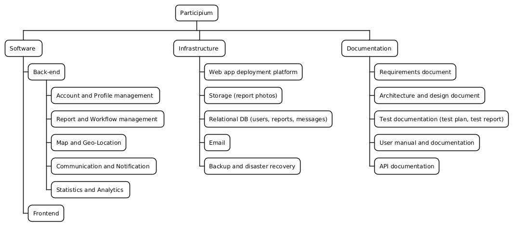
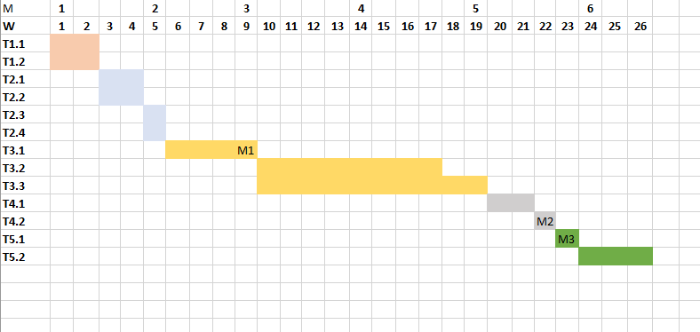

# Product Breakdown Structure (PBS)

| ID   | Deliverable                                 | Type           | Notes                                                                                                                  |
|:-----|:--------------------------------------------|:---------------|:-----------------------------------------------------------------------------------------------------------------------|
| S1   | Backend                                     | Software       | The main logic and background services of the application.                                                             |
| S1.1 | Account management service                  | Software       | Handles user registration, roles (citizens, operators, admins), and profile settings like email preferences.           |
| S1.2 | Report and Workflow management service      | Software       | The core module. It saves report text, handles photo uploads (up to 3), and tracks the report's status (Pending, etc.).|
| S1.3 | Map and Geo-Location service                | Software       | Dedicated to handling latitude/longitude coordinates and OpenStreetMap integration to show issues on the map.          |
| S1.4 | Communication and Notification service      | Software       | Generates in-platform alerts, handles the "follow" feature, sends emails, and manages direct messages.                 |
| S1.5 | Analytics service                           | Software       | Calculates time trends for public views and generates advanced data for admins (like the top 1% reporters).            |
| S2   | Frontend (Web Client Responsive)            | Software       | The web interface for all users. We only need a responsive web app, no native mobile apps are required.                |
| I1   | Web application deployment platform         | Infrastructure | The server environment used to host our website.                                                                       |
| I2   | Storage (report photos)                     | Infrastructure | Dedicated space to save the photos uploaded by users.                                                                  |
| I3   | Relational Database                         | Infrastructure | The database to store users, reports, categories, and messages.                                                        |
| I4   | Email service                               | Infrastructure | The service used to send automated email notifications.                                                                |
| I5   | Backup and disaster recovery                | Infrastructure | System to save data copies and restore them if something goes wrong.                                                   |
| D1   | Requirements document                       | Documentation  | A list of what the system needs to do (functional and non-functional requirements).                                    |
| D2   | Architecture and design document            | Documentation  | Diagrams and explanations of how the system is built.                                                                  |
| D3   | Test documentation (test plan, test report) | Documentation  | How we test the system and the results of those tests.                                                                 |
| D4   | User manual and documentation               | Documentation  | Simple instructions on how to use the platform.                                                                        |
| D5   | API documentation                           | Documentation  | Technical guide explaining how the front-end and back-end talk to each other.                                          |

---

# Work Breakdown Structure (WBS)

### WBS with traceability to PBS
| ID  | Work package                                   | Task Gantt | Traced PBS outputs (IDs) |
|:----|:-----------------------------------------------|:-----------|:--------------------------|
| 1.1 | Definition of functional requirements          | T1.1       | D1                        |
| 1.2 | Definition of non-functional requirements      | T1.2       | D1                        |
| 2.1 | Architecture definition                        | T2.1       | D2                        |
| 2.2 | Definition of cloud and storage architecture   | T2.2       | I1, I2, I3                |
| 2.3 | Backend design                                 | T2.3       | S1, D2                    |
| 2.4 | Frontend design                                | T2.4       | S2, D2                    |
| 3.1 | Development of APIs and backend skeleton       | T3.1       | I3, I4, I5, S1            |
| 3.2 | Development of the backend                     | T3.2       | I4, I5, I6, S1            |
| 3.3 | Development of the frontend                    | T3.3       | I4, I5, I6, S1            |
| 4.1 | Definition and execution of test plan          | T4.1       | D3                        |
| 4.2 | Acceptance testing with user                   | T4.2       | D3                        |
| 5.1 | Deployment of the system                       | T5.1       | D4, D5                    |
| 5.2 | Monitoring and bug fixing                      | T5.2       | -                         |

---

# Gantt, dependencies, and critical path

## Activity table
| ID   | Activity                                     | Duration | Dependencies | Start | End | Critical | Milestone |
|:-----|:---------------------------------------------|:---------|:-------------|:------|:----|:---------|:----------|
| T1.1 | Definition of functional requirements        | 2        | -            | 1     | 2   | yes      | no        |
| T1.2 | Definition of non-functional requirements    | 2        | -            | 1     | 2   | yes      | no        |
| T2.1 | Architecture definition                      | 2        | T1.1, T1.2   | 3     | 4   | yes      | no        |
| T2.2 | Definition of cloud and storage architecture | 2        | T1.1, T1.2   | 3     | 4   | yes      | no        | 
| T2.3 | Backend design                               | 1        | T2.1, T2.2   | 5     | 5   | yes      | no        |
| T2.4 | Frontend design                              | 1        | T2.1, T2.2   | 5     | 5   | yes      | no        |
| T3.1 | Development of APIs and backend skeleton     | 4        | T2.3         | 6     | 9   | yes      | yes       |
| T3.2 | Development of the backend                   | 8        | T3.1         | 10    | 17  | no       | no        |
| T3.3 | Development of the frontend                  | 10       | T2.4, T3.1   | 10    | 19  | yes      | no        |
| T4.1 | Definition and execution of test plan        | 2        | T3.2, T3.3   | 20    | 21  | yes      | no        |
| T4.2 | Acceptance testing with user                 | 1        | T4.1         | 22    | 22  | yes      | yes       |
| T5.1 | Deployment of the system                     | 1        | T4.2         | 23    | 23  | yes      | yes       |
| T5.2 | Monitoring and bug fixing                    | 3        | T5.1         | 24    | 26  | yes      | no        |

## Critical path
`T1.1 | T1.2 → T2.1 | T2.2 → T2.3 | T2.4 → T3.1 → T3.2 | T3.3 → T4.1 → T4.2 → T5.1 → T5.2`

Minimum duration of the activities in the GANTT diagram: 26 weeks.

---

# Risk Management

**Scales and thresholds**
- **Probability (P)**: 1 (rare) … 5 (almost certain)
- **Impact (I)**: 1 (minor) … 5 (critical)
- **Exposure**: `P × I` (range 1–25)

Risk level thresholds (by exposure):
- **Low**: 1–5
- **Medium**: 6–10
- **High**: 11–16
- **Very High**: >16

## Risks table
| ID | Risk | Category | P | I | P×I | Level | Mitigation / Response strategy |
|:---|:-----|:---------|--:|--:|----:|:------|:-------------------------------|
|  |      |          |   |   |     |       |                                |

