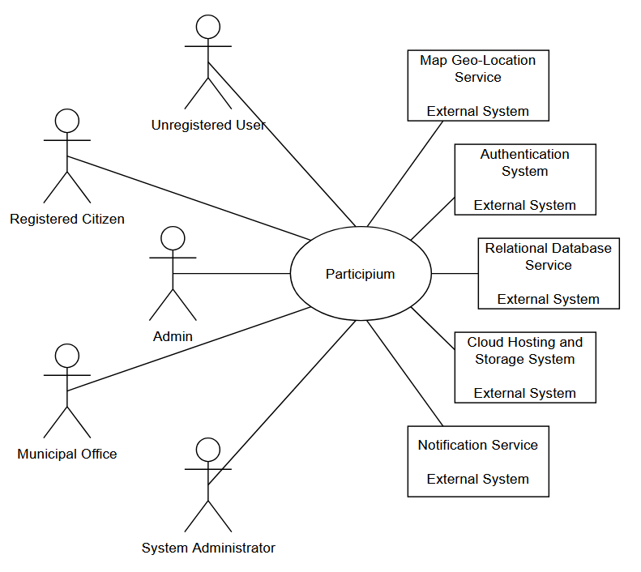

# 1) Stakeholders

| ID     | Stakeholder name     | Description                                                               | Role                                                                                   | Main concerns                                                                              | Relative priority |
| :----- | :------------------- | :------------------------------------------------------------------------ | :------------------------------------------------------------------------------------- | :----------------------------------------------------------------------------------------- | :---------------- |
| STK-01 | Unregistered User    | Visitor accessing the platform without authentication.                    | Consult public reports and explore issues on the map.                                  | Ease of use, accessibility, clarity of information, no mandatory registration barriers.    | Low               |
| STK-02 | Registered Citizen   | Authenticated user who interacts actively with the platform.              | Submit reports, upload photos, track status, follow issues, communicate with offices.  | Usability, responsiveness, transparency of report status, privacy of personal data.        | High              |
| STK-03 | Admin                | Platform-level manager with extended privileges.                          | Manage users, oversee system activity, access analytics, enforce policies.             | System security, data integrity, moderation workload, reliability of analytics.            | Medium            |
| STK-04 | Municipal Office     | Public authority responsible for handling reported issues.                | Review reports, validate submissions, assign tasks, manage resolution workflows.       | Workload management, efficiency, accuracy of reports, accountability, clear communication. | High              |
| STK-05 | System Administrator | Technical operator responsible for infrastructure and system maintenance. | Maintain infrastructure, ensure deployment, backups, security, and system performance. | System reliability, uptime, scalability, security threats, disaster recovery readiness.    | Medium            |

**Rationale and Justification:**
Stakeholders were identified by analyzing the primary users of the system (citizens) and the entities responsible for managing the reports (Municipal Office, Admins). *Registered Citizens* and the *Municipal Office* are assigned the highest priority since they are the core actors driving the system's workflow (submitting and resolving issues). *Admins* and *System Administrators* have a medium priority as they support the system's daily operations and security. *Unregistered users* have low priority as their interaction is limited to read-only public views.

---

# 2) Context Diagram

---

# 3) Interfaces

| ID    | Interface                 | Actor                            | Physical interface                       | Logical interface     | Exchanged data                                                           | Purpose (Why it is needed)                                                                    |
| :---- | :------------------------ | :------------------------------- | :--------------------------------------- | :-------------------- | :----------------------------------------------------------------------- | :-------------------------------------------------------------------------------------------- |
| IF-01 | User Interface            | Unregistered User                | Smartphone/PC with internet connection   | Web GUI               | Read-only report data, map tiles, public statistics.                     | To allow citizens to consult public issues and statistics without logging in.                 |
| IF-02 | User Interface            | Registered Citizen               | Smartphone/PC with internet connection   | Web GUI               | Report details (text, photos, coordinates), login credentials, messages. | To enable authenticated users to submit, track reports, and communicate.                      |
| IF-03 | User Interface            | Admin                            | Smartphone/PC with internet connection   | Web GUI               | User roles, advanced analytics data, system configuration.               | To allow platform management and visualization of advanced private statistics.                |
| IF-04 | User Interface            | Municipal Office                 | Workstation/PC with internet connection  | Web GUI               | Report status updates, clarification messages, task assignments.         | To enable operators to process, validate, and manage the lifecycle of reports.                |
| IF-05 | User Interface            | System Administrator             | Workstation with secure access (SSH/VPN) | Web GUI / CLI         | Server logs, deployment commands, backup data.                           | To maintain system infrastructure, ensure uptime, and manage disaster recovery.               |
| IF-06 | External System Interface | Map Geo-Location Service         | Internet connection                      | Map/Geo-Location APIs | GPS coordinates (latitude/longitude), map tiles.                         | To geo-locate issues visually on the interactive city map during submission and consultation. |
| IF-07 | External System Interface | Authentication System            | Internet connection                      | Authentication APIs   | User credentials, authentication tokens.                                 | To verify identities and secure user access to the platform.                                  |
| IF-08 | External System Interface | Relational Database Service      | Cloud Network connection                 | SQL/Database APIs     | SQL queries, system data records (users, reports, messages).             | To safely persist and retrieve all structured data of the system.                             |
| IF-09 | External System Interface | Cloud Hosting and Storage System | Cloud Network connection                 | Cloud Storage APIs    | Image files (.jpg, .png, etc.).                                          | To store and serve the photos attached to citizen reports (up to 3 per report).               |
| IF-10 | External System Interface | Notification Service             | Internet connection                      | Notification APIs     | Notification payloads (email content, system alerts).                    | To keep users updated automatically when a report status changes or a message is received.    |

---

# 4) Personas

| ID     | Name | Role | Background / Context | Goals | Constraints | Devices / Usage setting | Accessibility / Additional needs |
|:-------|:-----|:-----|:---------------------|:------|:------------|:------------------------|:---------------------------------|
| PER-01 | Marco Rossi | Registered Citizen | 45yo commuter who cycles to work daily. Frequently encounters road hazards. | Wants to report issues on the map, correctly categorize them, upload photos for evidence, and track their status | Has limited time, doesn't want to fill out long, complex forms while commuting. | Smartphone (outdoor usage, mobile network). | Needs a high-contrast map UI for outdoor visibility and large, easy-to-tap buttons. |
| PER-02 | Giulia Bianchi | Municipal Office | 38yo public worker in the infrastructure department. Deals with dozens of citizen reports daily. | Wants to review incoming reports, assign tasks to the right team, update statuses, and request clarifications from citizens if needed. | High daily workload, needs to avoid duplicate reports and confusing workflows. | Desktop PC (indoor office environment). | Relies on clear, structured table views and the ability to easily filter data. |
| PER-03 | Carlo Verdone | Unregistered User | 72yo retired local resident. Very attached to his neighborhood decorum but not tech-savvy. | Wants to explore reports to understand city issues, track their progress over time, and view public analytics to see trends. | Reluctant to share personal data, frustrated by mandatory login screens. | Tablet (used at home on Wi-Fi). | Requires extremely simple navigation, large font sizes, and clear status indicators. |
| PER-04 | Andrea Verdi | Admin | 30yo platform administrator at the municipality. | Wants to oversee general system activity, manage user roles, and extract advanced analytics for the city council. | Needs accurate data aggregation, deals with strict privacy compliance. | Laptop (office or remote working). | Needs a comprehensive dashboard with clear data visualization and charts. |
| PER-05 | Elena Neri | System Administrator | 40yo IT infrastructure specialist hired by the municipality. | Wants to ensure platform uptime, manage secure backups, and monitor database performance. | Strict security protocols and zero-downtime requirements. | Workstation with VPN access. | Requires secure authentication, terminal/CLI access, and clear system logs. |
| PER-06 | Serena Gialli | Registered Citizen | 22yo university student. Active in local environmental groups, often reporting illegal waste dumping. | Wants to mark her sensitive reports as anonymous and send direct messages to the Municipal Office to provide further clarifications. | Expects fast responses. Dislikes clunky, outdated web interfaces. | Smartphone (mostly used on the go) and Laptop. | Needs a highly responsive, modern UI with a clear messaging interface. |
| PER-07 | Roberto Conti | Municipal Office | 50yo field inspector for the city. Spends most of his day outside verifying the validity of citizen reports. | Wants to validate or reject reports directly from the field so that only relevant issues are processed. | Operates in areas with potentially poor internet connectivity. Needs quick actions. | Company tablet (outdoor usage, sometimes under direct sunlight). | Requires a streamlined interface with offline-tolerant features or low data usage. |
| PER-08 | Luigi Ferrara | Registered Citizen | 60yo owner of a small shop in the city center. Deeply cares about the decorum near his business. | Wants to receive optional email notifications on reports he follows, so he can stay informed without checking the app. | Very busy with his shop, has low tolerance for complex registration steps. | Desktop PC (behind the shop counter) and Smartphone. | Relies heavily on the email notification system. Prefers reading detailed updates in his inbox. |

---

# 5) User Stories

| ID    | Persona/Role                          | User story (As a… I want… so that…)                                                                                                               |
| :---- | :------------------------------------ | :------------------------------------------------------------------------------------------------------------------------------------------------ |
| US-01 | Unregistered User                     | As an Unregistered User, I want to create an account and verify my email so that I can access the features reserved to authenticated users        |
| US-02 | Unregistered User/ Registered Citizen | As an Unregistered User/Registered Citizen, I want to explore reports on the map so that I can visually understand issues in my city                                                                                 |
| US-03 | Unregistered User/ Registered Citizen | As an Unregistered User/Registered Citizen, I want to browse reports in a filterable table and export them in CSV so that I can use them for transparency, offline analysis or sharing                               |
| US-04 | Unregistered User/ Registered Citizen | As an Unregistered User/Registered Citizen, I want to open a report detail page so that I can read its description, view its photos and check its current status                                                     |
| US-05 | Unregistered User/ Registered Citizen | As an Unregistered User/Registered Citizen I want to view public statistics filtered by category or by day/week/month so that I can analyze trends in my city                                                        |
| US-06 | Registered Citizen                    | As a Registered Citizen, I want to log in so that I can access to my personal features                                                                                                                               |
| US-07 | Registered Citizen                    | As a Registered Citizen, I want to define and update my profile information so that my data is up to date.                                                                                                                              |
| US-08 | Registered Citizen                    | As a Registered Citizen, I want to manage my preferences including notification settings and profile picture so that the platform behaves according to my needs                              |
| US-09 | Registered Citizen                    | As a Registered Citizen, I want to submit a report by selecting a position on the map, writing a description, choosing a category and uploading up to 3 photos so that I can notify the Municipal Office about a problem.      |
| US-10 | Registered Citizen                    | As a Registered Citizen, I want to track status updates on reports so that I'm always informed about their progress                                          |
| US-11 | Registered Citizen                    | As a Registered Citizen, I want to receive in-platform notifications (optionally sent by email) on followed reports so that I stay informed                  |
| US-12 | Registered Citizen                    | As a Registered Citizen, I want to follow reports submitted by other citizens so that I can receive updates about their evolution                            |
| US-13 | Registered Citizen                    | As a Registered Citizen, I want to mark a report as anonymous so that my identity is not publicly visible.                                                   |
| US-14 | Registered Citizen                    | As a Registered Citizen, I want to reply to the messages of the Municipal Office so that I can provide clarifications about a report                         |
| US-15 | Municipal Office                      | As a Municipal Office operator, I want to review incoming reports so that I can assess their validity                                                        |
| US-16 | Municipal Office                      | As a Municipal Office operator, I want to assign a report to the appropriate team so that it's handled correctly                                             |
| US-17 | Municipal Office                      | As a Municipal Office operator, I want to update the status of a report so that citizens are informed about its progress                                     |
| US-18 | Municipal Office                      | As a Municipal Office operator, I want to validate or reject a report with an explicit motivation so that only relevant issues are processed                 |
| US-19 | Municipal Office                      | As a Municipal Office operator, I want to request clarification from citizens so that I can better understand reported issues                                |
| US-20 | Admin                                 | As an Admin, I want to view private statistics including reports by status, type, reporter and top reporters so that I can monitor platform activity and analyze data    |
| US-21 | Admin                                 | As an Admin, I want to manage configuration aspects so that I can control access to the platform and enforce policies                                                    |

---

# 6) Functional Requirements (FR)

| ID | Requirement statement (The system shall…) | Priority | User story ID | Notes |
|:------|:------------------------------------------|:---------|:--------------|:------|
| FR-1  |The system shall provide means to create and manage user accounts|     |     |    |
| FR-1.1   |The system shall allow users to define and update profile information|Critical| US-07     |    |
| FR-1.2   |The system shall verify user email addresses through a verification process|Critical| US-01     |    |
| FR-1.3   |The system shall allow users to store and manage preferences including optional profile photo and email notification|Important| US-08     |    |
| FR-1.4   |The system shall allow users to log in|Critical| US-06    |    |
| FR-2  |The system shall provide means to submit reports|     ||    |
| FR-2.1   |The system shall allow citizens to submit a report by specifying a geo-location on the map and providing a description of the issue.|Critical|US-09     |    |
| FR-2.2   |The system shall allow citizens to upload up to 3 photos per report |Important|US-09     |    |
| FR-2.3   |The system shall allow citizens to assign a category to a report|Critical|US-09     |    |
| FR-2.4   |The system shall allow citizens to mark a report as anonymous for public visibility|Important|US-13     |    |
| FR-3  |The system shall manage the lifecycle of reports|     ||    |
| FR-3.1   |The system shall allow municipal operators to update the status of reports|Critical|US-17     |    |
| FR-3.2   |The system shall allow municipal operators to validate or reject reports|Critical|US-18     |    |
| FR-4  |The system shall provide means to browse and explore reports|     ||    |
| FR-4.1   |The system shall display reports on an interactive map using the map service|Critical|US-02     |    |
| FR-4.2   |The system shall provide a table view of reports|Important|US-03     |    |
| FR-4.3   |The system shall allow filtering by category, status, and time period or relevant attributes|Important|US-03    |    |
| FR-4.4   |The system shall allow exporting report data in CSV format|Optional|US-03     |    |
| FR-5  |The system shall provide report tracking capabilities|     ||    |
| FR-5.1   |The system shall provide a report detail view to users including updates over time|Critical|US-04     |    |
| FR-5.2   |The system shall allow users to track updates over time for reports they have created|Critical|US-10     |    |
| FR-5.3   |The system shall allow Registered Citizens to follow reports|Important|US-12     |    |
| FR-6  |The system shall provide notification mechanisms|     ||    |
| FR-6.1   |The system shall notify the citizens following the report when the report status changes|Important|US-11    |    |
| FR-6.2   |The system shall support optional email notifications based on user preferences|Important|US-11    |    |
| FR-7  |The system shall provide messaging functionality between citizens and municipal offices|     ||    |
| FR-7.1   |The system shall allow citizens to send messages to municipal operators|Important|US-14     |    |
| FR-7.2   |The system shall allow municipal operators to request clarifications from citizens|Important|US-19     |    |
| FR-8  |The system shall support report management by municipal offices|     ||    |
| FR-8.1   |The system shall allow operators to review incoming reports|Critical|US-15     |    |
| FR-8.2   |The system shall allow assignment of reports to appropriate teams|Important|US-16     |    |
| FR-9  |The system shall provide statistical information|     ||    |
| FR-9.1   |The system shall display public statistics to all users|Important|US-05     |    |
| FR-9.2   |The system shall provide administrators with access to private statistics including charts and tables about the number of reports by status, type, reporter, their combinations, and top reporters by type|Important|US-20     |    |

---

# 7) Non-Functional Requirements (NFR)

| ID     | Category       | Requirement statement                                                                                                                                                   | Metric / Target                     | Verification | Priority  | Notes                                                                                       |
| :----- | :------------- | :---------------------------------------------------------------------------------------------------------------------------------------------------------------------- | :---------------------------------- | :----------- | :-------- | :------------------------------------------------------------------------------------------ |
| NFR-01 | Efficiency     | The web pages shall load within 5 seconds for at least 95% of the requests                                                                                              | Speed                               | Test         | Important |                                                                                             |
| NFR-02 | Efficiency     | Photo upload for profile or report shall complete within 10 seconds for at least 95% of the requests                                                                    | Speed                               | Test         | Important |                                                                                             |
| NFR-03 | Efficiency     | Registered Users shall be able to login within 7 seconds report shall complete within 10 seconds for at least 95% of the requests                                       | Speed                               | Test         | Important |                                                                                             |
| NFR-04 | Efficiency     | The Web UI shall consume less than 500MB of memory in the browser                                                                                                       | Memory                              | Inspection   | Important |                                                                                             |
| NFR-05 | Maintenability | The system shall allow a feature to be integrated within 250 ph of development                                                                                          | Effort (person x hour)              | Analysis     | Important |                                                                                             |
| NFR-06 | Maintenability | The system shall allow a bug to be fixed within 90 ph of development                                                                                                    | Effort (person x hour)              | Analysis     | Critical  |                                                                                             |
| NFR-07 | Maintenability | The system shall allow the porting to a mobile application within 1000 ph of development                                                                                | Effort (person x hour)              | Analysis     | Important | **Assumption** that in the future may be desirable to develop a mobile application  derable |
| NFR-08 | Maintenability | Each photo uploaded in the system shall be smaller than 2MB                                                                                                             | Size (MB)                           | Inspection   | Important | To reduce cloud usage                                                                       |
| NFR-09 | Usability      | A User shall do less than 3 errors per day after learning the system for 3 minutes                                                                                      | Number of errors / Time             | Test         | Important |                                                                                             |
| NFR-10 | Usability      | A User with visual impairments shall do less than 10 errors per day after learning the system for 10 minutes                                                            | Number of errors / Time             | Test         | Important |                                                                                             |
| NFR-11 | Reliability    | The website shall be reachable for at least 99% of the time with down time shorter than 2 hours                                                                         | Time                                | Analysis     | Critical  |                                                                                             |
| NFR-12 | Portability    | The system shall be compatible at least with the principal browser engines (e.g. blink, gecko, goanna, webkit) by covering at least the 99% of the market share         | Percentage of market share coverage | Inspection   | Important |                                                                                             |
| NFR-13 | Portability    | The system shall be compatible at least with the principal screen form factor and ratio (e.g. mobile, tablet, desktop) by covering at least the 99% of the market share | Percentage of market share coverage | Inspection   | Important |                                                                                             |
