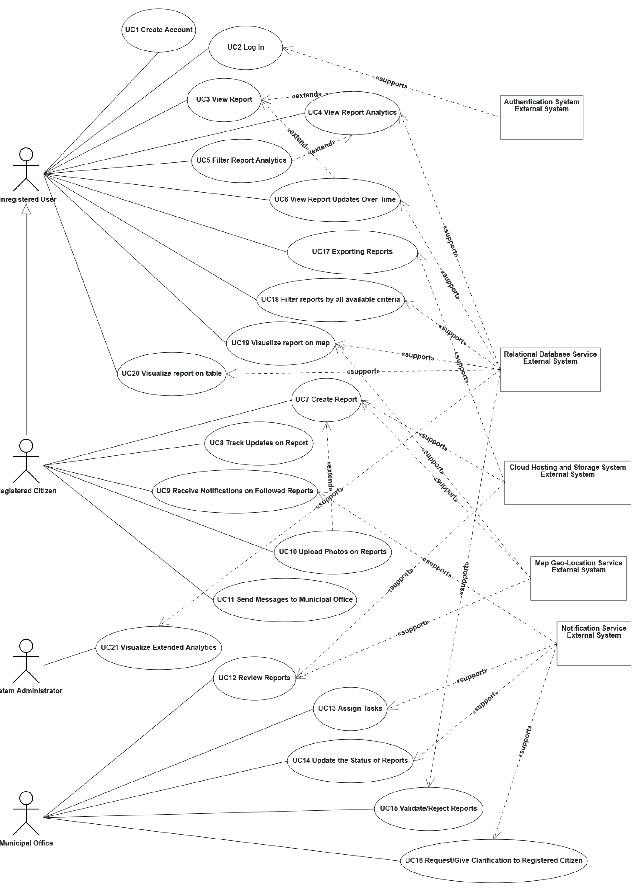

# 1) Use Case Diagram

# 2) Use Case Narratives

Add one narrative for each use case shown in the diagram.

| Use Case | UC1 - Create Account |
| :--- | :--- |
| ID | UC1 |
| Scope | Municipal Reporting System |
| Level | User Goal |
| Intention in Context | The Unregistered User wants to register in the system to become a Registered Citizen. |
| Primary actor | Unregistered User |
| Supporting actors | Authentication System |
| Stakeholders' interests | Municipal Office: ensuring safe and verified accounts for reliable reporting. |
| Precondition | The user does not have an active account. |
| Minimum guarantees | None. |
| Success guarantees | A new account is created, and the user becomes a Registered Citizen. |
| Trigger | The user selects the registration option. |
| Main success scenario | 1. The user asks to register. 2. The system shows the signup page asking for user data and password. 3. The user inserts the required data. 4. The system validates the data via the Authentication System. 5. The system confirms the creation of the account. |
| Extensions | 3a. The user cancels the registration. - 3a.1 The use case ends. 4a. Invalid data or email already in use. - 4a.1 The system shows an error and restarts from step 2. |

 

| Use Case | UC2 - Log In |
| :--- | :--- |
| ID | UC2 |
| Scope | Municipal Reporting System |
| Level | User Goal |
| Intention in Context | The user wants to access their account to submit or manage reports. |
| Primary actor | Unregistered User |
| Supporting actors | Authentication System |
| Stakeholders' interests | None. |
| Precondition | The user has registered an account. |
| Minimum guarantees | None. |
| Success guarantees | The user is successfully logged in. |
| Trigger | The user selects the login option. |
| Main success scenario | 1. The user asks to log in. 2. The system shows the credentials form. 3. The user inserts email and password. 4. The system validates the credentials via the Authentication System. 5. The system grants access and logs the user in. |
| Extensions | 4a. Invalid credentials. - 4a.1 The system shows an error message and restarts from step 2. |

 

| Use Case | UC3 - View Report |
| :--- | :--- |
| ID | UC3 |
| Scope | Municipal Reporting System |
| Level | User Goal |
| Intention in Context | The user wants to visualize the details of a specific report. |
| Primary actor | Unregistered User, Registered Citizen |
| Supporting actors | Relational Database Service |
| Stakeholders' interests | Citizens: stay informed about urban issues. |
| Precondition | There is at least one report available in the system. |
| Minimum guarantees | The system displays available public reports. |
| Success guarantees | The requested report's details are shown to the user. |
| Trigger | The user selects a report from the map or list. |
| Main success scenario | 1. The user selects a report to view. 2. The system retrieves report data from the Relational Database Service. 3. The system shows the details (status, location, description). |
| Extensions | 2a. Database unreachable. - 2a.1 The system shows an error. Use case fails. |

 

| Use Case | UC4 - View Report Analytics |
| :--- | :--- |
| ID | UC4 |
| Scope | Municipal Reporting System |
| Level | Sub-function (Extends UC3) |
| Intention in Context | The user wants to view aggregate data and statistics related to reports. |
| Primary actor | Unregistered User, Registered Citizen |
| Supporting actors | Relational Database Service |
| Stakeholders' interests | Municipal Office: provide transparency on resolved issues. |
| Precondition | The user is viewing reports (UC3). |
| Minimum guarantees | None. |
| Success guarantees | Statistical data is displayed. |
| Trigger | The user clicks on the analytics dashboard. |
| Main success scenario | 1. The user requests to view analytics. 2. The system queries the Relational Database Service. 3. The system displays graphs and statistics regarding reports. |
| Extensions | None. |

 

| Use Case | UC5 - Filter Report Analytics |
| :--- | :--- |
| ID | UC5 |
| Scope | Municipal Reporting System |
| Level | Sub-function (Extends UC4) |
| Intention in Context | The user wants to filter the analytics data by specific criteria (e.g., date, category). |
| Primary actor | Unregistered User, Registered Citizen |
| Supporting actors | None |
| Stakeholders' interests | None. |
| Precondition | The user is viewing report analytics (UC4). |
| Minimum guarantees | Previous filters are cleared if invalid. |
| Success guarantees | Analytics are updated according to the selected filters. |
| Trigger | The user applies a filter to the analytics view. |
| Main success scenario | 1. The user selects filter parameters (e.g., time range, status). 2. The system applies filters to the current data set. 3. The system updates the analytics view. |
| Extensions | 2a. No data matches the filter. - 2a.1 The system shows an empty state message. |

 

| Use Case | UC6 - View Report Updates Over Time |
| :--- | :--- |
| ID | UC6 |
| Scope | Municipal Reporting System |
| Level | Sub-function (Extends UC3) |
| Intention in Context | The user wants to see the chronological history and status changes of a report. |
| Primary actor | Unregistered User, Registered Citizen |
| Supporting actors | Relational Database Service |
| Stakeholders' interests | None. |
| Precondition | The user is viewing a specific report (UC3). |
| Minimum guarantees | None. |
| Success guarantees | A timeline of updates is shown. |
| Trigger | The user requests the history of a report. |
| Main success scenario | 1. The user requests the update history. 2. The system fetches historical logs from the Relational Database Service. 3. The system displays the timeline of status changes. |
| Extensions | None. |

 

| Use Case | UC7 - Create Report |
| :--- | :--- |
| ID | UC7 |
| Scope | Municipal Reporting System |
| Level | User Goal |
| Intention in Context | The user wants to report a new municipal issue. |
| Primary actor | Registered Citizen |
| Supporting actors | Map Geo-Location Service |
| Stakeholders' interests | Municipal Office: receive accurate details and location to fix the issue. |
| Precondition | User is logged in as Registered Citizen. |
| Minimum guarantees | The system retains a local draft if submission fails. |
| Success guarantees | The report is created and registered in the system. |
| Trigger | The user selects "New Report". |
| Main success scenario | 1. The user asks to create a report. 2. The system shows the reporting form. 3. The user inserts details (title, description) and selects a category. 4. The system acquires the location via Map Geo-Location Service. 5. The user optionally can mark the report as anonymous. 6. The user confirms data and submits. 7. The system saves the report. |
| Extensions | 4a. Geo-Location Service unavailable. - 4a.1 The user manually selects the location. 5a. The user attaches a photo (UC10 starts). |

 

| Use Case | UC8 - Track Updates on Report |
| :--- | :--- |
| ID | UC8 |
| Scope | Municipal Reporting System |
| Level | User Goal |
| Intention in Context | The user wants to follow specific reports to be updated on their resolution. |
| Primary actor | Registered Citizen |
| Supporting actors | None |
| Stakeholders' interests | None. |
| Precondition | User is logged in. A report exists. |
| Minimum guarantees | None. |
| Success guarantees | The report is added to the user's tracked list. |
| Trigger | The user clicks "Track" on a report. |
| Main success scenario | 1. The user selects a report and clicks "Track". 2. The system registers the tracking preference for the user. 3. The system shows a confirmation. |
| Extensions | 1a. The user is already tracking the report. - 1a.1 The system removes the tracking (Untrack). |

 

| Use Case | UC9 - Receive Notifications on Followed Reports |
| :--- | :--- |
| ID | UC9 |
| Scope | Municipal Reporting System |
| Level | System Goal |
| Intention in Context | The user is informed about updates on tracked reports with the same type of notifications as for reports they have created. |
| Primary actor | Registered Citizen |
| Supporting actors | Notification Service |
| Stakeholders' interests | None. |
| Precondition | The user is tracking a report (UC8) and its status is updated. |
| Minimum guarantees | The update is visible inside the app dashboard. |
| Success guarantees | A notification is successfully delivered to the user. |
| Trigger | The Municipal Office updates a tracked report. |
| Main success scenario | 1. The system detects a status change on a tracked report. 2. The system sends an alert via the Notification Service. 3. If the user has enabled email notifications, the system sends an email notification via the Notification Service. 4. The user receives the notification. |
| Extensions | 2a. Notification Service fails. - 2a.1 The system logs the failure; the user sees the update only upon next login. |

 

| Use Case | UC10 - Upload Photos on Reports |
| :--- | :--- |
| ID | UC10 |
| Scope | Municipal Reporting System |
| Level | Sub-function (Extends UC7) |
| Intention in Context | The user wants to attach photographic evidence to a report. |
| Primary actor | Registered Citizen |
| Supporting actors | Cloud Hosting and Storage System |
| Stakeholders' interests | Municipal Office: visual proof helps assess the issue faster. |
| Precondition | The user is creating a report (UC7). |
| Minimum guarantees | None. |
| Success guarantees | The photo is successfully attached to the report. |
| Trigger | The user clicks "Upload Photo". |
| Main success scenario | 1. The user selects an image file. 2. The system uploads the file to the Cloud Hosting and Storage System. 3. The system validates the upload and links it to the draft report. |
| Extensions | 2a. File is too large or invalid format. - 2a.1 The system shows an error and rejects the file. |

 

| Use Case | UC11 - Send Messages to Municipal Office |
| :--- | :--- |
| ID | UC11 |
| Scope | Municipal Reporting System |
| Level | User Goal |
| Intention in Context | The user wants to communicate directly with the office regarding a report. |
| Primary actor | Registered Citizen |
| Supporting actors | Notification Service |
| Stakeholders' interests | Municipal Office: gather additional context. |
| Precondition | User is logged in. |
| Minimum guarantees | None. |
| Success guarantees | The message is delivered to the Municipal Office. |
| Trigger | The user selects the messaging option. |
| Main success scenario | 1. The user types a message and clicks send. 2. The system stores the message and triggers the Notification Service. 3. The Municipal Office receives the message. |
| Extensions | 1a. Message is empty. - 1a.1 The system prevents sending. |

 

| Use Case | UC12 - Review Reports |
| :--- | :--- |
| ID | UC12 |
| Scope | Municipal Reporting System |
| Level | User Goal |
| Intention in Context | The admin wants to browse and inspect incoming reports. |
| Primary actor | Municipal Office |
| Supporting actors | Relational Database Service |
| Stakeholders' interests | Citizens: want their reports to be handled quickly. |
| Precondition | Admin is logged into the Municipal Office dashboard. |
| Minimum guarantees | None. |
| Success guarantees | The admin successfully views the pending reports. |
| Trigger | The admin accesses the report queue. |
| Main success scenario | 1. The admin opens the dashboard. 2. The system retrieves pending reports from the Relational Database Service. 3. The system displays the reports list. |
| Extensions | None. |

 

| Use Case | UC13 - Assign Tasks |
| :--- | :--- |
| ID | UC13 |
| Scope | Municipal Reporting System |
| Level | User Goal |
| Intention in Context | The admin assigns a verified report to a specific operational team. |
| Primary actor | Municipal Office |
| Supporting actors | Notification Service |
| Stakeholders' interests | Operational Teams: need clear tasks. |
| Precondition | The admin is reviewing a valid report. |
| Minimum guarantees | None. |
| Success guarantees | The task is assigned and the relevant team is notified. |
| Trigger | The admin selects "Assign Task". |
| Main success scenario | 1. The admin selects a team/operator and confirms assignment. 2. The system updates the task owner in the database. 3. The system uses the Notification Service to alert the team. |
| Extensions | None. |

 

| Use Case | UC14 - Update the Status of Reports |
| :--- | :--- |
| ID | UC14 |
| Scope | Municipal Reporting System |
| Level | User Goal |
| Intention in Context | The admin updates the state of a report (e.g., In Progress, Resolved). |
| Primary actor | Municipal Office |
| Supporting actors | Relational Database Service, Notification Service |
| Stakeholders' interests | Citizens: want to know if their issue is fixed. |
| Precondition | Admin is managing a report. |
| Minimum guarantees | None. |
| Success guarantees | The status is updated, and followers are notified. |
| Trigger | The admin changes the status dropdown. |
| Main success scenario | 1. The admin selects a new status and confirms. 2. The system updates the Relational Database Service. 3. The system triggers the Notification Service to alert tracking users (UC9). |
| Extensions | None. |

 

| Use Case | UC15 - Validate/Reject Reports |
| :--- | :--- |
| ID | UC15 |
| Scope | Municipal Reporting System |
| Level | User Goal |
| Intention in Context | The admin approves a valid report or rejects spam/duplicate reports. |
| Primary actor | Municipal Office |
| Supporting actors | Notification Service |
| Stakeholders' interests | Municipal Office: maintain database quality. |
| Precondition | A new report is pending review. |
| Minimum guarantees | None. |
| Success guarantees | The report state is set to 'Valid' or 'Rejected'. |
| Trigger | The admin clicks "Validate" or "Reject". |
| Main success scenario | 1. The admin reviews the report and clicks Validate. 2. The system marks the report as public/verified. 3. The system notifies the author via Notification Service. |
| Extensions | 1a. The admin clicks Reject. - 1a.1 The system prompts for a reason, marks as rejected, and hides it from public view. |

 

| Use Case | UC16 - Request/Give Clarification to Registered Citizen |
| :--- | :--- |
| ID | UC16 |
| Scope | Municipal Reporting System |
| Level | User Goal |
| Intention in Context | The admin asks the reporting citizen for more details to process the issue. |
| Primary actor | Municipal Office |
| Supporting actors | Notification Service |
| Stakeholders' interests | None. |
| Precondition | The report lacks sufficient detail to be validated or assigned. |
| Minimum guarantees | None. |
| Success guarantees | The clarification request is sent to the citizen. |
| Trigger | The admin selects "Request Clarification". |
| Main success scenario | 1. The admin writes a clarification message. 2. The system saves the message and puts the report "On Hold". 3. The system alerts the citizen via the Notification Service. |
| Extensions | None. |

| Use Case | UC17 - Exporting Reports |
| :--- | :--- |
| ID | UC17 |
| Scope | Municipal Reporting System |
| Level | User Goal |
| Intention in Context | The user wants to download a CSV file of the reports. |
| Primary actor | Unregistered User |
| Supporting actors | Relational Database Service |
| Stakeholders' interests | Citizens: offline data analysis. |
| Precondition | The user is viewing reports. |
| Minimum guarantees | None. |
| Success guarantees | A CSV file is successfully downloaded. |
| Trigger | The user clicks export. |
| Main success scenario | 1. The user asks to export reports. 2. The system retrieves data from the Relational Database Service. 3. The system downloads the file. |
| Extensions | None. |

 

| Use Case | UC18 - Filter reports by all available criteria |
| :--- | :--- |
| ID | UC18 |
| Scope | Municipal Reporting System |
| Level | User Goal |
| Intention in Context | The user wants to filter reports by category, status, etc. |
| Primary actor | Unregistered User |
| Supporting actors | Relational Database Service |
| Stakeholders' interests | None. |
| Precondition | The user is viewing the report table or map. |
| Minimum guarantees | Previous filters are cleared if invalid. |
| Success guarantees | Reports are updated according to filters. |
| Trigger | The user applies a filter. |
| Main success scenario | 1. The user selects filter parameters. 2. The system queries the Relational Database Service. 3. The system updates the view. |
| Extensions | 2a. No reports match the filter. - 2a.1 The system shows an empty state message. |

 

| Use Case | UC19 - Visualize report on map |
| :--- | :--- |
| ID | UC19 |
| Scope | Municipal Reporting System |
| Level | User Goal |
| Intention in Context | The user wants to view the locations of reports on a city map. |
| Primary actor | Unregistered User |
| Supporting actors | Map Geo-Location Service, Relational Database Service |
| Stakeholders' interests | Citizens: visual understanding of issues. |
| Precondition | None. |
| Minimum guarantees | The map is displayed. |
| Success guarantees | Reports are visualized as markers on the map. |
| Trigger | The user opens the map view. |
| Main success scenario | 1. The user accesses the map. 2. The system loads the map via Map Geo-Location Service. 3. The system fetches reports from the Relational Database Service. 4. The system places markers on the map. |
| Extensions | 2a. Map Geo-Location Service is unavailable. - 2a.1 The system shows an error message. |

 

| Use Case | UC20 - Visualize report on table |
| :--- | :--- |
| ID | UC20 |
| Scope | Municipal Reporting System |
| Level | User Goal |
| Intention in Context | The user wants to browse reports in a structured list. |
| Primary actor | Unregistered User |
| Supporting actors | Relational Database Service |
| Stakeholders' interests | None. |
| Precondition | None. |
| Minimum guarantees | An empty table is shown if database fails. |
| Success guarantees | The list of reports is shown. |
| Trigger | The user opens the table view. |
| Main success scenario | 1. The user accesses the table view. 2. The system fetches reports from the Relational Database Service. 3. The system displays the rows. |
| Extensions | None. |

 

| Use Case | UC21 - Visualize Extended Analytics |
| :--- | :--- |
| ID | UC21 |
| Scope | Municipal Reporting System |
| Level | User Goal |
| Intention in Context | The Sysadmin wants to view advanced analytics about reports and users. |
| Primary actor | System Administrator |
| Supporting actors | Relational Database Service |
| Stakeholders' interests | Sysadmin: monitor platform usage. |
| Precondition | User is logged in as System Administrator. |
| Minimum guarantees | None. |
| Success guarantees | Private statistics are displayed. |
| Trigger | The admin accesses the private analytics dashboard. |
| Main success scenario | 1. The admin navigates to private statistics. 2. The system queries the Relational Database Service. 3. The system displays charts and advanced tables. |
| Extensions | None. |

# 3) Traceability Table

| UC ID | REQ ID |
| :---- | :----- |
| UC-01 | FR-1.1, FR-1.2, FR-1.3   |
| UC-02 | FR-1.4   |
| UC-03 | FR-5.1   |
| UC-04 | FR-9.1   |
| UC-05 | FR-9.3   |
| UC-06 | FR-5.1   |
| UC-07 | FR-2.1   |
| UC-08 | FR-5.3   |
| UC-09 | FR-6.1   |
| UC-10 | FR-2.2   |
| UC-11 | FR-7.1   |
| UC-12 | FR-8.1   |
| UC-13 | FR-8.2   |
| UC-14 | FR-3.1   |
| UC-15 | FR-3.2   |
| UC-16 | FR-7.2   |
| UC-17 | FR-4.4   |
| UC-18 | FR-4.3   |
| UC-19 | FR-4.1   |
| UC-20 | FR-4.2   |
| UC-21 | FR-9.2   |
