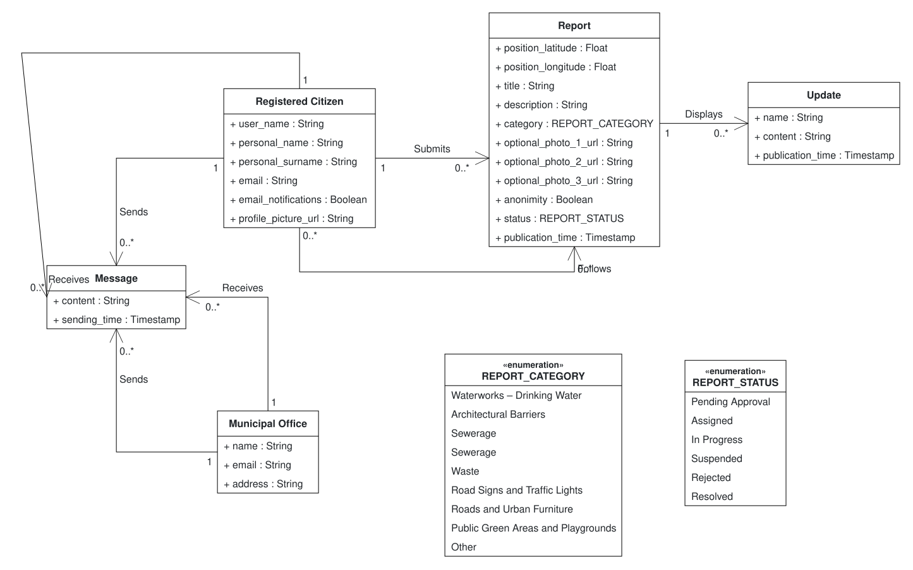
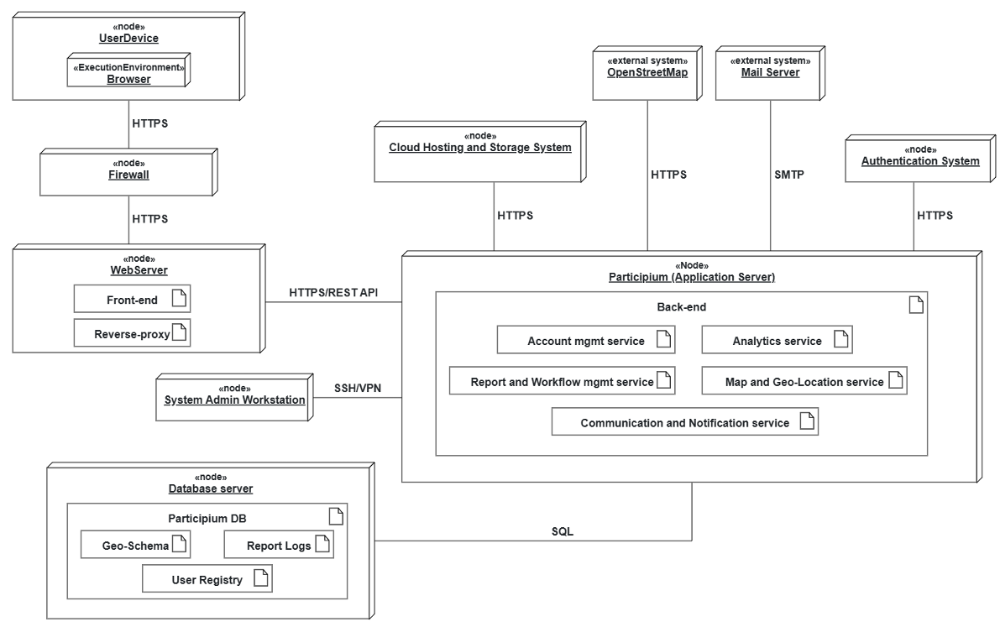

# 1) Glossary / Class Diagram

---

# 2) Deployment Diagram

Note: in this diagram, OpenStreetMap and Mail Server are marked as «external system» as they're third-party services we have no control over. Cloud Hosting and Storage System, Database server and Authentication System are instead modelled as «node», because although not physically owned by us, they are services we provision, configure and manage as part of our infrastructure.

