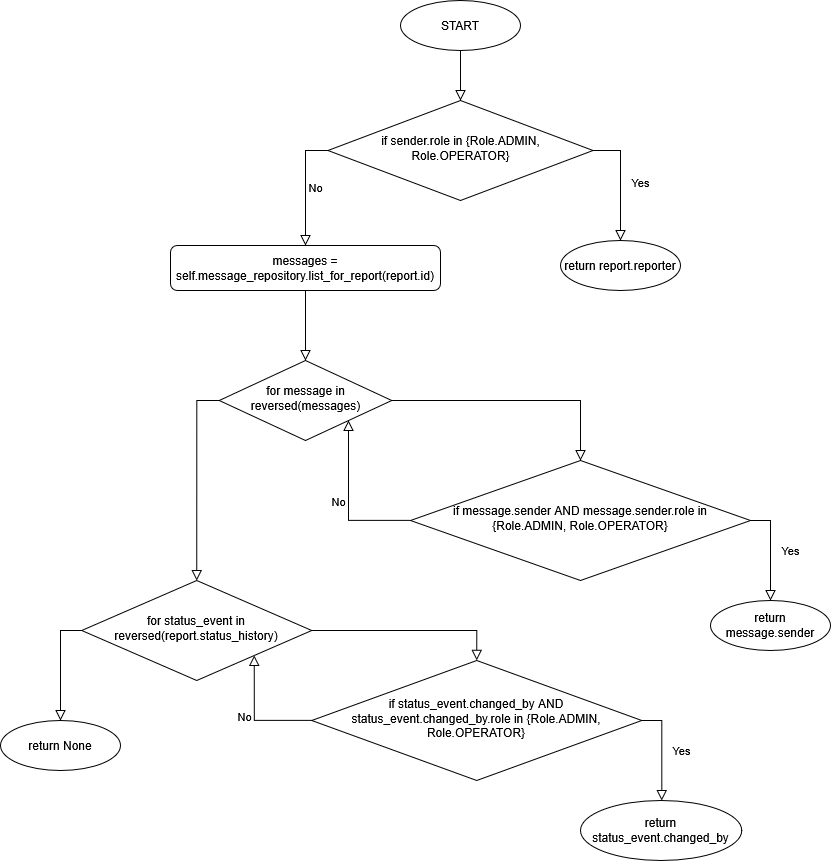
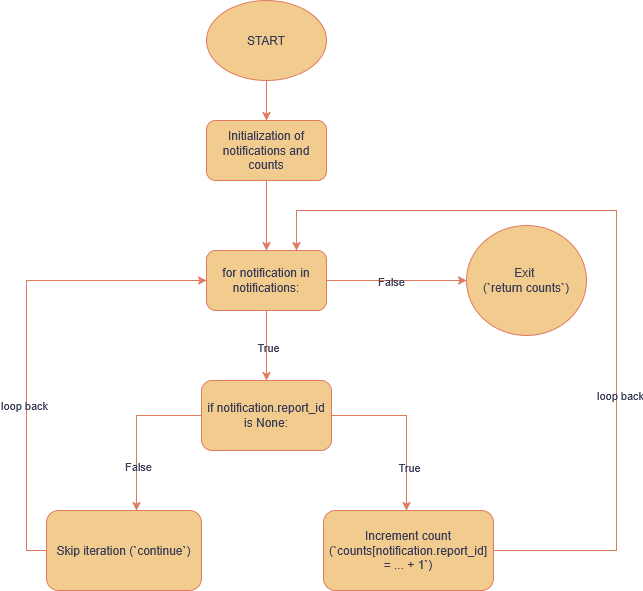
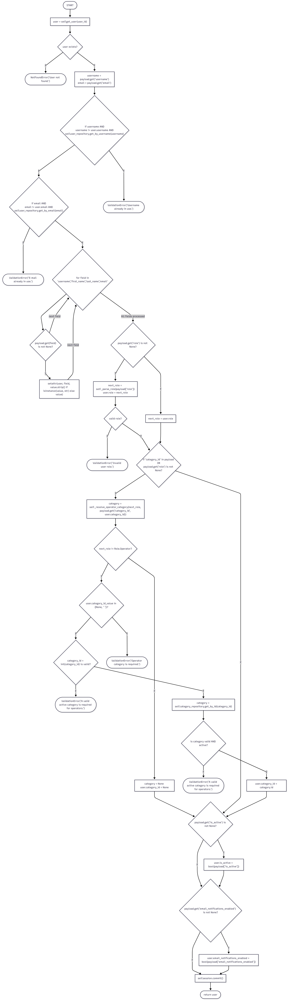

## 1 `ReportService.create_report`

### Control Flow Graph

- 

### Atomic Conditions

### Structural Lower Bound

### Node Coverage

### Edge Coverage

### Condition Coverage

### Loop Coverage

### Path Coverage

### Minimal Suite Test

## 2 `MessagingService._resolve_recipient`

### Control Flow Graph

- 

### Atomic Conditions

| ID | Atomic Condition |
|---|---|
| A | `sender.role` is not in {Role.ADMIN, Role.OPERATOR} |
| B | `message` is not in reversed(messages) (loop condition) |
| C | `message.sender` is None |
| D | `message.sender.role` is not in {Role.ADMIN, Role.OPERATOR} |
| E | `status_event` is not in reversed(report.status_history) (loop condition) |
| F | `status_event.changed_by` is None |
| G | `status_event.changed_by.role` is not in {Role.ADMIN, Role.OPERATOR} |

### Structural Lower Bound

The minimum number of test cases needed to cover all distinct outputs:

| ID | Output                    |
| -- | ------------------------- |
| 1  | `report.reporter`         |
| 2  | `message.sender`          |
| 3  | `status_event.changed_by` |
| 4  | `None`                    |

### Node Coverage

All nodes must be visited at least once.

| Node | Description | Covered by |
|------|-------------|------------|
| N1 | `if sender.role in {Role.ADMIN, Role.OPERATOR}` | all TC |
| N2 | `return report.reporter` | TC-01 |
| N3 | `messages = self.message_repository.list_for_report(report.id)` | TC-02..TC-08 |
| N4 | `for message in reversed(messages)` | TC-02..TC-08 |
| N5 | `if message.sender and message.sender.role in {Role.ADMIN, Role.OPERATOR}` | TC-02..TC-08 |
| N6 | `return message.sender` | TC-02, TC-03, TC-04 |
| N7 | `for status_event in reversed(report.status_history)` | TC-05..TC-08 |
| N8 | `if status_event.changed_by and status_event.changed_by.role in {Role.ADMIN, Role.OPERATOR}` | TC-05..TC-08 |
| N9 | `return status_event.changed_by` | TC-05, TC-06, TC-07 |
| N10 | `return None` | TC-08 |

**Node coverage = 100% with TC-01..TC-08**

### Edge Coverage

All edges must be traversed at least once.

| Edge | From | To | Covered by |
|------|------|-----|------------|
| e0 | N1 | N2 | TC-01 |
| e1 | N1 | N3 | TC-02..TC-08 |
| e2 | N3 | N4 | TC-02..TC-08 |
| e3 | N4 | N5 | TC-02..TC-08 |
| e4 | N5 | N6 | TC-02, TC-03, TC-04 |
| e5 | N5 | N4 | TC-03, TC-04 |
| e6 | N4 | N7 | TC-05..TC-08 |
| e7 | N7 | N8 | TC-05..TC-08 |
| e8 | N8 | N9 | TC-05, TC-06, TC-07 |
| e9 | N8 | N7 | TC-06, TC-07 |
| e10 | N7 | N10 | TC-08 |

**Edge coverage = 100% with TC-01..TC-08**

### Condition Coverage

| Condition | True | False |
|-----------|------|-------|
| A | TC-02..TC-08 | TC-01 |
| B | TC-05, TC-08 | TC-02..TC-07 |
| C | TC-03, TC-04 | TC-02 |
| D | TC-04 | TC-02 |
| E | TC-08 | TC-05..TC-07 |
| F | TC-06, TC-07 | TC-05 |
| G | TC-07 | TC-05 |

**Condition coverage = 100% with TC-01..TC-08**

### Loop Coverage

#### Loop 1: `messages`

| Case | Description | Covered by |
|---|---|---|
| 0 iterations | no messages present | TC-05, TC-08 |
| 1 iteration | exactly one message | TC-02 |
| 2+ iterations | multiple messages checked | TC-03, TC-04 |

#### Loop 2: `status_history`

| Case | Description | Covered by |
|---|---|---|
| 0 iterations | no status history present | TC-02..TC-04, TC-08 |
| 1 iteration | exactly one status event | TC-05 |
| 2+ iterations | multiple status events checked | TC-06, TC-07 |

**Loop coverage = 100% with TC-01..TC-08**

### Path Coverage

| Path ID | Description | Covered by |
|---|---|---|
| P-01 | sender.role in {ADMIN, OPERATOR} returns report.reporter immediately | TC-01 |
| P-02 | enter message loop, first message satisfies full condition (message.sender exists and role is valid), return message.sender | TC-02 |
| P-03 | message loop, first check fails (message.sender is None), later message satisfies full condition, return message.sender | TC-03 |
| P-04 | message loop, first fails (message.sender is None), second fails (invalid role), later message satisfies full condition, return message.sender | TC-04 |
| P-05 | no valid message sender, enter status loop, first changed_by satisfies full condition, return status_event.changed_by | TC-05 |
| P-06 | status loop, first check fails (changed_by is None), later satisfies full condition, return status_event.changed_by | TC-06 |
| P-07 | status loop, first fails (changed_by is None), second fails (invalid role), later satisfies full condition, return status_event.changed_by | TC-07 |
| P-08 | no valid sender in messages or status history, return None | TC-08 |

### Minimal Suite Test

| TC-ID | Description | Example |
|---|---|---|
| TC-01 | sender role is ADMIN or OPERATOR, recipient resolved immediately as report reporter | `_resolve_recipient(report, admin_user)` where `admin_user.role = ADMIN` and `report.reporter = citizen_user` |
| TC-02 | first message contains valid sender with ADMIN/OPERATOR role | `_resolve_recipient(report, citizen_user)` where `messages = [Message(sender=admin_user)]` |
| TC-03 | first message fails because sender is None, later message has valid ADMIN/OPERATOR sender | `_resolve_recipient(report, citizen_user)` where `messages = [Message(sender=admin_user), Message(sender=None)]` |
| TC-04 | first message fails because sender is None, second fails because role is invalid, third message has valid ADMIN/OPERATOR sender | `_resolve_recipient(report, citizen_user)` where `messages = [Message(sender=admin_user), Message(sender=other_citizen), Message(sender=None)]` |
| TC-05 | no valid message sender, first status event contains valid ADMIN/OPERATOR changed_by | `_resolve_recipient(report, citizen_user)` where `messages=[]` and `status_history=[Status(changed_by=operator_user)]` |
| TC-06 | no valid message sender, first status event fails because changed_by is None, later status event is valid | `_resolve_recipient(report, citizen_user)` where `status_history=[Status(changed_by=admin_user), Status(changed_by=None)]` |
| TC-07 | no valid message sender, first status event fails because changed_by is None, second fails because role invalid, third is valid | `_resolve_recipient(report, citizen_user)` where `status_history=[Status(changed_by=admin_user), Status(changed_by=other_citizen), Status(changed_by=None)]` |
| TC-08 | all message checks fail and all status checks fail, recipient cannot be resolved | `_resolve_recipient(report, citizen_user)` where `messages=[]` and `status_history=[]` |

## 3 `NotificationService.notify_status_change`

### Control Flow Graph

- 

### Atomic Conditions

### Structural Lower Bound

### Node Coverage

### Edge Coverage

### Condition Coverage

### Loop Coverage

### Path Coverage

### Minimal Suite Test

## 4 `NotificationService.count_unread_message_notifications_by_report`

### Control Flow Graph

- 

### Atomic Conditions

| ID | Atomic Condition |
|---|---|
| A | The `notifications` iterable has at least one more element (loop entry guard) |
| B | `notification.report_id is None` |

### Structural Lower Bound

The minimum number of test cases needed to cover all distinct outputs:

| ID | Output |
|---|---|
| 1 | Returns `{}` — list is empty (zero iterations) |
| 2 | Returns `{}` — list is non-empty but every `report_id` is `None` |
| 3 | Returns `{report_id: count, …}` — at least one valid `report_id` present |

---

### Node Coverage

All nodes must be visited at least once.

| Node | Description | Covered by |
|---|---|---|
| N1 | Fetch notifications from repository; initialize `counts = {}` | all TC |
| N2 | For-loop condition: next item available in `notifications`? | all TC |
| N3 | Bind `notification` to the next element | TC-02, TC-03 |
| N4 | `if notification.report_id is None` | TC-02, TC-03 |
| N5 | `counts[notification.report_id] = counts.get(notification.report_id, 0) + 1` | TC-03 |
| N6 | `return counts` | all TC |

**Node coverage = 100% with TC-01, TC-02, TC-03**

---

### Edge Coverage

All edges must be traversed at least once.

| Edge | From | To | Covered by |
|---|---|---|---|
| e1 | N1 | N2 | all TC |
| e2 | N2 | N6 | all TC |
| e3 | N2 | N3 | TC-02, TC-03 |
| e4 | N3 | N4 | TC-02, TC-03 |
| e5 | N4 | N2 | TC-02 |
| e6 | N4 | N5 | TC-03 |
| e7 | N5 | N2 | TC-03 |

**Edge coverage = 100% with TC-01, TC-02, TC-03**

---

### Condition Coverage

| Condition | True | False |
|---|---|---|
| A: loop entered (next element exists) | TC-02, TC-03 | TC-01 |
| B: `notification.report_id is None` | TC-02 | TC-03 |

**Condition coverage = 100% with TC-01, TC-02, TC-03**

---

### Loop Coverage

| Case | Description | Covered by |
|---|---|---|
| 0 iterations | Empty notification list; loop body never entered | TC-01 |
| 1 iteration | Exactly one notification with `report_id = None`; loop body entered once | TC-02 |
| 2+ iterations | Three notifications across two distinct `report_id` values; loop body executed multiple times | TC-03 |

**Loop coverage = 100% with TC-01, TC-02, TC-03**

---

### Path Coverage

| Path ID | Description | Covered by |
|---|---|---|
| P-01 | Zero iterations; empty list, `counts = {}` returned immediately | TC-01 |
| P-02 | One iteration; `report_id` is `None`, entry skipped via `continue` | TC-02 |
| P-03 | One iteration; valid `report_id`, count incremented | subsumed by TC-03 |
| P-04 | Multiple iterations; all valid `report_id`s, counts accumulated across reports | TC-03 |

**Full path coverage is not feasible** due to the unbounded loop. TC-01, TC-02, TC-03 achieve 100% edge and condition coverage while exercising all structurally distinct loop behaviors.

---

### Minimal Suite Test

| TC-ID | Description | Example |
|---|---|---|
| TC-01 | Empty notification list, loop never entered | `count_unread_message_notifications_by_report(user_id=1)` where repository returns `[]` |
| TC-02 | One notification with `report_id = None`, skipped | `count_unread_message_notifications_by_report(user_id=2)` where repository returns one notification with `report_id=None` |
| TC-03 | Multiple notifications with valid `report_id`s, counts aggregated | `count_unread_message_notifications_by_report(user_id=3)` where repository returns `[notif(100), notif(100), notif(200)]` |

**Minimal suite = 3 TC**

## 5 `UserService.update_user`

### Control Flow Graph

- 

### Atomic Conditions

| ID | Atomic Condition |
|---|---|
| A | `user` is not None |
| B | `username` is truthy |
| C | `username != user.username` |
| D | `self.user_repository.get_by_username(username)` returns a user |
| E | `email` is truthy |
| F | `email != user.email` |
| G | `self.user_repository.get_by_email(email)` returns a user |
| H | `payload.get(field) is not None` (loop condition) |
| I | `payload.get('role') is not None` |
| J | `Role(role_value)` is valid |
| K | `'category_id' in payload` |
| L | `next_role != Role.Operator`|
| M | `category_id_value in {None, ''}` |
| N | `category_id` is a valid integer |
| O | `category` exists|
| P | `category.is_active`|
| Q | `payload.get('is_active') is not None` |
| R | `payload.get('email_notifications_enabled') is not None` |

 

### Structural Lower Bound

The minimum number of test cases needed to cover all distinct outputs:

| ID | Output                                       |
| -- | -------------------------------------------- |
| 1  | `NotFoundError`                              |
| 2  | `ValidationError` username in use            |
| 3  | `ValidationError` email in use               |
| 4  | `ValidationError` invalid role               |
| 5  | `ValidationError` operator category required |
| 6  | `ValidationError` invalid category id type   |
| 7  | `ValidationError` category not found or inactive |
| 8  | `User returned successfully`                 |

---

### Node Coverage

All nodes must be visited at least once.

| Node | Description | Covered by |
|---|---|---|
| N1 | `user = self.get_user(user_id)` | all TC |
| N2 | `if user exists` | all TC |
| N3 | `raise NotFoundError('User not found.')` | TC-01 |
| N4 | `username = payload.get('username')` / `email = payload.get('email')` | TC-02..TC-12 |
| N5 | `if username AND username != user.username AND get_by_username(username)` | TC-02..TC-12 |
| N6 | `raise ValidationError('Username already in use.')` | TC-02 |
| N7 | `if email AND email != user.email AND get_by_email(email)` | TC-03..TC-12 |
| N8 | `raise ValidationError('Email already in use.')` | TC-03 |
| N9 | loop over `['username', 'first_name', 'last_name', 'email']` | TC-04..TC-12 |
| N10 | `if payload.get(field) is not None` | TC-04..TC-12 |
| N11 | `setattr(user, field, value.strip() if isinstance(value, str) else value)` | TC-06, TC-11, TC-12 |
| N12 | `if payload.get('role') is not None` | TC-04..TC-12 |
| N13 | `next_role = self_parse_role(payload['role'])` / `user.role = next_role` | TC-04,TC-05, TC-05B, TC-07, TC-07B, TC-08 |
| N13A|  `valid role?` | TC-04,TC-05, TC-05B, TC-07, TC-07B, TC-08 |
| N14 | `raise ValidationError('Invalid user role.')` | TC-04 |
| N15 | `next_role = user.role` | TC-06, TC-09..TC-12 |
| N16 | `if 'category_id' in payload OR payload.get('role') is not None` | TC-05..TC-12 |
| N17 | `category = _resolve_operator_category(next_role, payload.get('category_id', user.category_id))` |TC-05, TC-05B, TC-07, TC-07B, TC-08 |
| N18 | `if next_role != Role.OPERATOR` | TC-05, TC-05B, TC-07, TC-07B, TC-08 |
| N19 | `return None` -> `user.category_id = None` | TC-08 |
| N20 | `if category_id_value in {None, ''}` |TC-05, TC-05B, TC-07, TC-07B|
| N21 | `raise ValidationError('Operator category is required.')` | TC-05 |
| N22 | `category_id = int(category_id_value)` | TC-05B, TC-07, TC-07B |
| N23 | `raise ValidationError('A valid active category is required.')` (invalid int) | TC-05B |
| N24 | `category = self.category_repository.get_by_id(category_id)` | TC-07, TC-07B |
| N25 | `if not category or not category.is_active` | TC-07, TC-07B |
| N26 | `raise ValidationError('A valid active category is required.')` (not found/inactive) | TC-07B |
| N27 | `user.category_id = category.id` | TC-07 |
| N28 | `if payload.get('is_active') is not None` | TC-06, TC-07, TC-08, TC-09, TC-10, TC-11, TC-12 |
| N29 | `user.is_active = bool(payload['is_active'])` | TC-09 |
| N30 | `if payload.get('email_notifications_enabled') is not None` | TC-06,TC-07,TC-08..TC-12 |
| N31 | `user.email_notifications_enabled = bool(payload['email_notifications_enabled'])` | TC-11 |
| N32 | `self.session.commit()` | TC-05, TC-06, TC-07, TC-08..TC-12 |
| N33 | `return user` | TC-05, TC-06, TC-07, TC-08..TC-12 |

**Node coverage = 100% with TC-01..TC-12**

---

### Edge Coverage

All edges must be traversed at least once.

| Edge | From | To | Covered by |
|---|---|---|---|
| e0 | N1 | N2 | all TC |
| e1 | N2 | N3 | TC-01 |
| e2 | N2 | N4 | TC-02..TC-12 |
| e2A | N4 | N5 | TC-03..TC-12 |
| e3 | N5 | N6 | TC-02 |
| e4 | N5 | N7 | TC-03..TC-12 |
| e5 | N7 | N8 | TC-03 |
| e6 | N7 | N9 | TC-04..TC-12 |
| e6A |N9 | N10 | TC-04..TC-12 |
| e6B |N10 | N9 | TC-04,TC-05,TC-05B,TC-07, TC-07B,TC-08,TC-09,TC-10|
| e7 | N10 | N11 | TC-06, TC-11, TC-12 |
| e7B | N11 | N9 | TC-06, TC-11, TC-12 |
| e8 | N9 | N12 | TC-04..TC-12 |
| e9 | N12 | N13 | TC-04, TC-05, TC-05B, TC-07, TC-07B, TC-08 |
| e10 | N13 | N13A | TC-04, TC-05, TC-05B, TC-07, TC-07B, TC-08 |
| e11 | N12 | N15 | TC-06, TC-09, TC-10, TC-11, TC-12 |
| e12 | N13A | N14 | TC-04 |
| e13 | N13A | N16 | TC-05, TC-05B, TC-07, TC-07B, TC-08 |
| e14 | N15 | N16 | TC-06, TC-09, TC-10, TC-11, TC-12 |
| e15 | N16 | N17 | TC-05, TC-05B, TC-07, TC-07B, TC-08 |
| e15A | N17 | N18 | TC-05, TC-05B, TC-07, TC-07B, TC-08 |
| e16 | N16 | N28 | TC-06, TC-09, TC-10, TC-11, TC-12 |
| e17 | N18 | N19 | TC-08 |
| e18 | N18 | N20 | TC-05, TC-05B, TC-07, TC-07B |
| e19 | N20 | N21 | TC-05 |
| e20 | N20 | N22 | TC-05B, TC-07, TC-07B |
| e21 | N22 | N23 | TC-05B |
| e22 | N22 | N24 | TC-07, TC-07B |
| e22A | N24 | N25 | TC-07, TC-07B |
| e23 | N25 | N26 | TC-07B |
| e24 | N25 | N27 | TC-07 |
| e25 | N28 | N29 | TC-09 |
| e26 | N28 | N30 | TC-06, TC-07, TC-08, TC-10, TC-11, TC-12 |
| e27 | N30 | N31 | TC-11 |
| e28 | N30 | N32 | TC-06, TC-07, TC-08, TC-09, TC-10, TC-12 |
| e29 | N31 | N32 |TC-06, TC-07, TC-08, TC-09, TC-10, TC-11, TC-12 |
| e30 | N32 | N33 |TC-06, TC-07, TC-08, TC-09, TC-10, TC-11, TC-12 |

**Edge coverage = 100% with TC-01..TC-12**

---

### Condition Coverage

| Condition | True | False |
|---|---|---|
| A: `user` is not None | TC-02..TC-12 | TC-01 |
| B: `username` is truthy | TC-02, TC-06, TC-11 | TC-10 |
| C: `username != user.username` | TC-02, TC-06 | TC-11 |
| D: `get_by_username(username)` returns a user | TC-02 | TC-06 |
| E: `email` is truthy | TC-03, TC-06, TC-12 | TC-10 |
| F: `email != user.email` | TC-03, TC-06 | TC-12 |
| G: `get_by_email(email)` returns a user | TC-03 | TC-06 |
| H: `payload.get(field) is not None` | TC-06, TC-11, TC-12 | TC-10 |
| I: `payload.get('role') is not None` | TC-04, TC-05, TC-05B, TC-07, TC-07B, TC-08 | TC-06 |
| J: `Role(role_value)` is valid | TC-05, TC-05B, TC-07, TC-07B, TC-08 | TC-04|
| K: `'category_id' in payload` | TC-05, TC-05B, TC-07, TC-07B | TC-08 |
| L: `next_role != Role.OPERATOR` | TC-08 | TC-05, TC-05B, TC-07, TC-07B |
| M: `category_id_value in {None, ''}` | TC-05 | TC-05B, TC-07, TC-07B |
| N: `category_id` is a valid integer | TC-07, TC-07B | TC-05B |
| O: `category` exists | TC-07 | TC-07B |
| P: `category.is_active` | TC-07 | TC-07B |
| Q: `payload.get('is_active') is not None` | TC-09 | TC-06 |
| R: `payload.get('email_notifications_enabled') is not None` | TC-11 | TC-06 |

**Condition coverage = 100% with TC-01..TC-12**

---

### Loop Coverage

| Case | Description | Covered by |
|---|---|---|
| 0 iterations | Empty payload, no field is present | TC-10 |
| 1 iteration | Exactly one field present in payload | TC-11 |
| 2+ iterations | Multiple fields present in payload, loop executes more than once | TC-06 |

**Loop coverage = 100% with TC-06, TC-10, TC-11**

---

### Path Coverage

| Path ID | Description | Covered by |
|---|---|---|
| P-01 | user not found → NotFoundError | TC-01 |
| P-02 | username already in use → ValidationError | TC-02 |
| P-03 | email already in use → ValidationError | TC-03 |
| P-04 | invalid role → ValidationError | TC-04 |
| P-05 | operator with category_id=None → ValidationError | TC-05 |
| P-05B | operator with non-integer category_id → ValidationError | TC-05B |
| P-06 | update base string fields, no role/category/flags | TC-06 |
| P-07 | role=OPERATOR with valid active category → User updated | TC-07 |
| P-07B | role=OPERATOR with inactive/missing category → ValidationError | TC-07B |
| P-08 | role=CITIZEN, category cleared → User updated | TC-08 |
| P-09 | update is_active flag → User updated | TC-09 |
| P-10 | empty payload, nothing updated → User unchanged | TC-10 |
| P-11 | same username, no uniqueness check triggered → User unchanged | TC-11 |
| P-12 | same email, no uniqueness check triggered → User unchanged | TC-12 |

**Full path coverage is not feasible** due to combinatorial explosion.

---

### Minimal Suite Test

| TC-ID | Description | Example |
|---|-------|-------|
| TC-01 | user_id not found | `update_user(1000, {})` where user 1000 does not exist |
| TC-02 | username already used by another account | `update_user(1, {"username": "mario.rossi"})` where "mario.rossi" is already taken by user 2 |
| TC-03 | email already used by another account | `update_user(1, {"email": "mario.rossi@example.com"})` where that email belongs to user 2 |
| TC-04 | invalid role value in payload| `update_user(1, {"role": "superadmin"})` where "superadmin" is not a valid Role |
| TC-05 | operator without category | `update_user(1, {"role": "operator", "category_id": None})` |
| TC-05B | operator role with non-integer category_id| `update_user(1, {"role": "operator", "category_id": "abc"})` |
| TC-06 | update multiple string fields successfully | `update_user(1, {"username": "giulia.verdi", "first_name": "Giulia", "last_name": "Verdi", "email": "giulia.verdi@example.com"})` |
| TC-07 | role = OPERATOR with valid active category | `update_user(1, {"role": "operator", "category_id": 3})` where category 3 exists and is active |
| TC-07B | role = OPERATOR with inactive/missing category |`update_user(1, {"role": "operator", "category_id": 99})` where category 99 is inactive |
| TC-08 | role changed to non-operator| `update_user(1, {"role": "citizen"})` where user 1 was previously an operator |
| TC-09 | update is_active flag |`update_user(1, {"is_active": False})` to deactivate an existing active user 
| TC-10 | empty payload, nothing updated| `update_user(1, {})` where user 1 exists, all fields remain unchanged |
| TC-11 | same username as current | `update_user(1, {"username": "maria.rossi"})` where user 1 already has username "maria.rossi" |
| TC-12 | same email as current| `update_user(1, {"email": "maria.rossi@example.com"})` where user 1 already has that email |

**Minimal suite = 14 TC** 